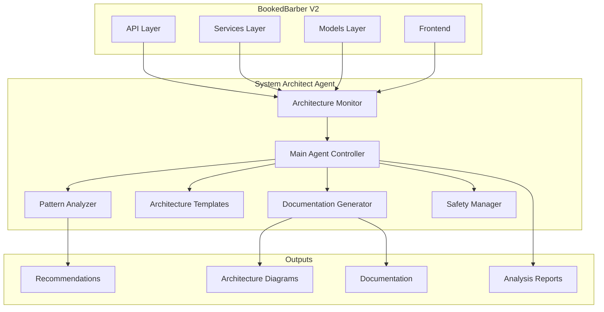

# System Architect Agent for BookedBarber V2

## Overview

The System Architect Agent is a comprehensive architectural guidance system specifically designed for the BookedBarber V2 platform. It provides expert architectural analysis, ensures clean architecture principles, and maintains alignment with the Six Figure Barber methodology.

## Key Features

### 🏗️ Comprehensive Architectural Analysis
- **Clean Architecture Compliance**: Ensures proper layer separation and dependency direction
- **Microservices Design**: Analyzes service boundaries and communication patterns
- **API Design Review**: Validates RESTful design, versioning, and documentation
- **Database Architecture**: Optimizes schema design, indexing, and query performance
- **Integration Patterns**: Reviews external service integrations and webhooks

### 📊 Six Figure Barber Methodology Alignment
- **Revenue Optimization**: Ensures features support commission tracking and premium pricing
- **Client Value Creation**: Validates booking experience and relationship building features
- **Business Efficiency**: Reviews automation and workflow optimization
- **Professional Growth**: Analyzes analytics and performance tracking capabilities
- **Scalability**: Ensures multi-location and franchise support

### 🔍 Auto-Trigger System
- **Major Feature Additions**: Triggers on 10+ file changes
- **API Changes**: Monitors new endpoints and significant API modifications
- **Database Changes**: Tracks schema changes and migrations
- **Integration Updates**: Detects webhook and external service changes
- **Performance Issues**: Monitors for architectural performance concerns
- **Security Changes**: Reviews authentication and authorization modifications

### 📋 Documentation Generation
- **System Overview**: Comprehensive architecture documentation
- **API Documentation**: OpenAPI/Swagger compatible documentation
- **Diagrams**: C4 model, sequence, component, and database diagrams
- **Implementation Guides**: Step-by-step architectural guidance
- **Compliance Reports**: Architecture compliance and violation reports

### 🛡️ Safety Mechanisms
- **Resource Limits**: Memory, CPU, and execution time monitoring
- **Emergency Stop**: Manual and automatic emergency stop capabilities
- **Protected Files**: Prevents modification of critical system files
- **Rate Limiting**: Controls agent execution frequency
- **Audit Logging**: Comprehensive logging of all operations

## Architecture



## Installation

### Prerequisites
- Python 3.8+
- BookedBarber V2 project structure
- Required dependencies: `watchdog`, `psutil`

### Automatic Deployment
```bash
# Navigate to project root
cd /path/to/6fb-booking

# Run deployment script
python .claude/deploy-system-architect-agent.py

# For dry run (preview changes)
python .claude/deploy-system-architect-agent.py --dry-run
```

### Manual Installation
```bash
# Install dependencies
pip install watchdog psutil

# Verify installation
python .claude/agents/test_system_architect.py
```

## Configuration

### Main Configuration File: `.claude/system-architect-agent-config.json`

```json
{
  "enabled": true,
  "triggers": {
    "file_change_threshold": 10,
    "new_api_endpoints": true,
    "database_migrations": true,
    "integration_changes": true
  },
  "safety_limits": {
    "max_executions_per_hour": 3,
    "cooldown_minutes": 30,
    "max_execution_time_minutes": 20
  },
  "bookedbarber_v2_config": {
    "six_figure_barber_focus": true,
    "technology_stack_validation": true
  }
}
```

### Monitoring Configuration
File patterns monitored for architectural changes:
- **API Endpoints**: `**/api/**/*.py`, `**/router*/*.py`
- **Database Models**: `**/models/**/*.py`, `**/schema*/*.py`
- **Services**: `**/services/**/*.py`
- **Frontend Components**: `**/components/**/*.tsx`

## Usage

### Automatic Monitoring
Start architectural monitoring to auto-trigger analysis:
```bash
python .claude/start-architecture-monitoring.py
```

### Manual Execution
Trigger analysis manually with event data:
```bash
python .claude/agents/system-architect-agent.py '{
  "changed_files": ["backend-v2/api/v2/booking.py"],
  "new_files": ["backend-v2/services/analytics_service.py"],
  "event_type": "api_design_review"
}'
```

### Sub-Agent Integration
The agent integrates with the existing sub-agent system:
```bash
python .claude/sub-agent-control.py enable-agent system-architect
python .claude/sub-agent-control.py status
```

## Analysis Types

### 1. Major Feature Addition
**Triggers**: 10+ file changes, new service directories
**Analysis Focus**:
- Service boundary design
- Database schema impact
- API endpoint design
- Integration requirements
- Six Figure Barber alignment

### 2. API Design Review
**Triggers**: New API endpoints, significant API changes
**Analysis Focus**:
- RESTful design principles
- API versioning strategy
- Authentication/authorization
- Response format consistency
- Error handling patterns

### 3. Database Schema Change
**Triggers**: Migration files, model changes
**Analysis Focus**:
- Migration reversibility
- Index optimization
- Query performance impact
- Data integrity constraints
- Scalability considerations

### 4. Cross-System Integration
**Triggers**: Webhook changes, external service integration
**Analysis Focus**:
- Integration patterns
- Error handling and retries
- Security considerations
- Performance impact
- Monitoring requirements

### 5. Performance Optimization
**Triggers**: Performance issues, slow response times
**Analysis Focus**:
- Caching strategies
- Database optimization
- Code efficiency
- Scalability bottlenecks
- Resource utilization

### 6. Security Architecture Review
**Triggers**: Auth changes, security middleware updates
**Analysis Focus**:
- Authentication flows
- Authorization patterns
- Data protection
- Input validation
- Audit logging

## Output Examples

### Architecture Analysis Report
```markdown
# Architectural Analysis Report

**Event Type**: api_design_review
**Timestamp**: 2025-07-26T16:30:00Z

## Analysis Summary
New booking analytics endpoints require architectural review for performance and Six Figure Barber alignment.

## Recommendations
- Implement proper API versioning (v2)
- Add comprehensive error handling
- Include request/response validation
- Implement rate limiting for security
- Ensure mobile app compatibility

## Six Figure Barber Alignment
Strong alignment: Analytics endpoints support revenue optimization and professional growth tracking essential for the Six Figure Barber methodology.

## Implementation Guidance
1. Use FastAPI dependency injection for validation
2. Implement Pydantic models for request/response
3. Add proper HTTP status codes
4. Include comprehensive API documentation
```

### Generated Diagrams
The agent generates multiple diagram types:
- **System Context**: High-level system overview
- **Container Diagram**: Application and data store architecture
- **Component Diagram**: Internal component structure
- **Sequence Diagram**: Interaction flows
- **Database Schema**: Entity relationships

## Safety and Monitoring

### Resource Limits
- **Memory**: 1GB maximum usage
- **CPU**: 60% maximum usage
- **Execution Time**: 20 minutes maximum
- **File Operations**: 1000 operations maximum

### Emergency Stop
```bash
# Trigger emergency stop
python .claude/agents/safety_mechanisms.py --action emergency-stop

# Clear emergency stop
python .claude/agents/safety_mechanisms.py --action clear-stop
```

### Monitoring Dashboard
```bash
# View safety status
python .claude/agents/safety_mechanisms.py --action status

# View monitoring statistics
python .claude/agents/architecture_monitoring.py --action status
```

## Integration with BookedBarber V2

### Business Domain Analysis
The agent specifically analyzes these BookedBarber domains:
- **Booking Engine**: Real-time availability and scheduling
- **Payment Processing**: Stripe Connect and commission handling
- **User Management**: Multi-role authentication system
- **Analytics Engine**: Revenue tracking and business intelligence
- **Franchise Management**: Multi-location enterprise support

### Six Figure Barber Principles
Every analysis includes alignment checking for:
- **Revenue Optimization**: Commission tracking, premium pricing
- **Client Value Creation**: Enhanced booking experience
- **Business Efficiency**: Automated workflows
- **Professional Growth**: Performance analytics
- **Brand Building**: Marketing integrations
- **Scalability**: Multi-location support

## Troubleshooting

### Common Issues

#### Agent Not Triggering
1. Check if monitoring is enabled: `python .claude/agents/architecture_monitoring.py --action status`
2. Verify file patterns in configuration
3. Check cooldown periods and rate limits

#### High Resource Usage
1. Check current resource usage: `python .claude/agents/safety_mechanisms.py --action status`
2. Adjust limits in configuration
3. Enable throttling or reduce analysis depth

#### Missing Dependencies
```bash
pip install watchdog psutil
```

#### Test Failures
```bash
# Run comprehensive tests
python .claude/agents/test_system_architect.py

# Run specific test category
python -m unittest .claude.agents.test_system_architect.SystemArchitectAgentTest
```

### Logs and Debugging
- **Main Log**: `.claude/system-architect-agent.log`
- **Safety Log**: `.claude/safety_manager.log`
- **Monitoring Log**: `.claude/architecture_monitoring.log`
- **Deployment Log**: `.claude/deployment.log`

## Development and Customization

### Adding New Analysis Types
1. Extend `ArchitecturalEvent` enum in `system-architect-agent.py`
2. Add trigger detection in `_classify_architectural_event`
3. Implement analysis method in `_analyze_*` pattern
4. Add tests in `test_system_architect.py`

### Custom Templates
1. Add new domain to `BusinessDomain` enum
2. Implement template in `bookedbarber_architecture_templates.py`
3. Add validation rules
4. Update documentation

### Custom Monitoring
1. Extend file patterns in monitoring configuration
2. Add custom trigger conditions
3. Implement custom analysis logic
4. Update safety mechanisms if needed

## Performance Metrics

### Typical Performance
- **Analysis Time**: 2-15 seconds depending on complexity
- **Memory Usage**: 100-500MB during analysis
- **File Processing**: 1000+ files per analysis
- **Documentation Generation**: 30-60 seconds

### Optimization Tips
- Adjust file change thresholds to reduce false triggers
- Use exclusion patterns for non-architectural files
- Enable throttling for resource-constrained environments
- Implement caching for repeated analyses

## License and Support

This System Architect Agent is part of the BookedBarber V2 project and follows the same licensing terms.

### Support Resources
- **Documentation**: This README and generated docs
- **Tests**: Comprehensive test suite in `test_system_architect.py`
- **Configuration**: Well-documented configuration files
- **Logging**: Detailed logging for troubleshooting

### Contributing
1. Follow existing code patterns and architecture
2. Add comprehensive tests for new features
3. Update documentation and configuration
4. Ensure Six Figure Barber methodology alignment

---

**System Architect Agent v1.0.0** - Deployed on 2025-07-26

Providing comprehensive architectural guidance for BookedBarber V2 with enterprise-grade reliability and Six Figure Barber methodology alignment.