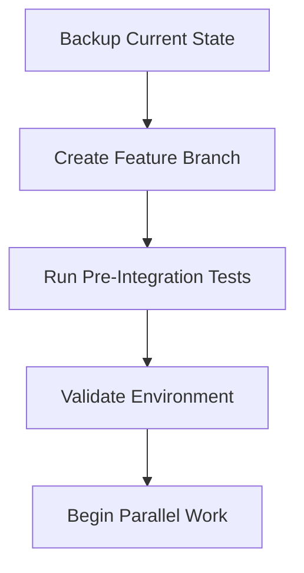
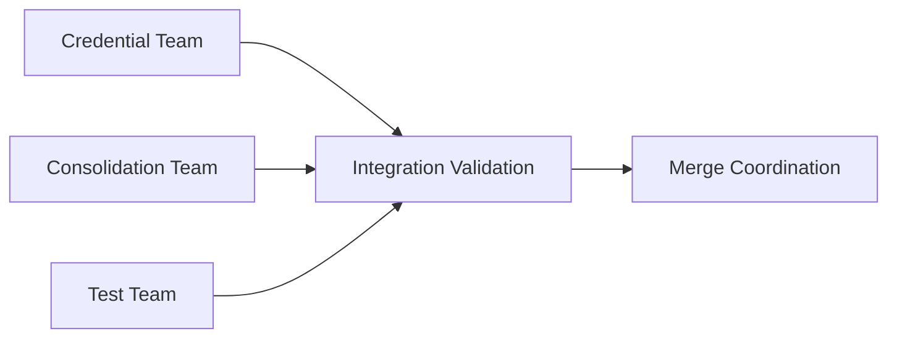
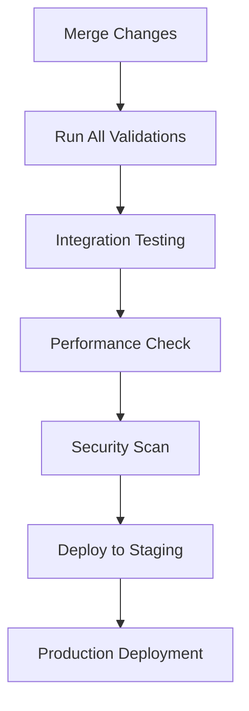

# Integration Guide

This guide explains how the parallel refactoring efforts (credential rotation, code consolidation, and test creation) work together and how to maintain system integrity.

## 🎯 Overview

Three major efforts are being coordinated:

1. **Credential Rotation & Security**: Securing all API keys, secrets, and sensitive data
2. **Code Consolidation**: Removing duplicate code and improving maintainability  
3. **Test Infrastructure**: Creating comprehensive tests for all services

This integration ensures these efforts don't conflict and the system remains stable.

## 🏗️ Integration Architecture

```
┌─────────────────────────────────────────────────────────────┐
│                     Integration Layer                       │
├─────────────────┬─────────────────┬─────────────────────────┤
│   Credential    │     Code        │    Test Infrastructure  │
│   Management    │ Consolidation   │                         │
│                 │                 │                         │
│ • Encryption    │ • Deduplication │ • Unit Tests           │
│ • Key Rotation  │ • Refactoring   │ • Integration Tests    │
│ • Secret Mgmt   │ • Import Cleanup│ • Coverage Reports     │
│ • Access Control│ • Service Merge │ • Validation Scripts   │
└─────────────────┴─────────────────┴─────────────────────────┘
│                                                             │
├─────────────────────────────────────────────────────────────┤
│                  Validation & Monitoring                    │
│                                                             │
│ • Pre-deployment checks  • Health monitoring               │
│ • Security scans        • Performance validation           │
│ • Import validation     • Rollback procedures              │
└─────────────────────────────────────────────────────────────┘
```

## 🔄 Integration Workflow

### Phase 1: Preparation


### Phase 2: Parallel Execution


### Phase 3: Integration & Deployment


## 📋 Integration Checklist

### Before Starting
- [ ] All teams aligned on timeline
- [ ] Feature branch created from main
- [ ] Current state backed up
- [ ] Environment validated
- [ ] Communication channels established

### During Development
- [ ] Regular sync meetings
- [ ] Shared documentation updated
- [ ] Integration tests passing
- [ ] No conflicts in shared files
- [ ] Security measures maintained

### Before Merging
- [ ] All validation scripts pass
- [ ] Security scan clean
- [ ] Test coverage adequate
- [ ] Performance impact acceptable
- [ ] Documentation updated

### After Deployment
- [ ] Health checks passing
- [ ] Monitoring active
- [ ] Rollback plan ready
- [ ] Team debriefing scheduled

## 🔐 Security Integration

### Credential Management During Integration

1. **Encryption Service Integration**
   ```python
   from utils.encryption import EncryptionService
   
   # All teams use the same encryption service
   encryption = EncryptionService()
   encrypted_value = encryption.encrypt(sensitive_data)
   ```

2. **Secret Rotation Coordination**
   ```bash
   # Coordinate secret rotation across all services
   python scripts/rotate_secrets.py --service all --notify-teams
   ```

3. **Access Control Updates**
   ```python
   # Update access controls for consolidated services
   from middleware.security import update_access_controls
   update_access_controls(consolidated_services)
   ```

### Security Validation Integration
- Credential scanner runs on all changes
- No hardcoded secrets in consolidated code
- Encrypted storage for all sensitive data
- Access controls updated for new service structure

## 🔄 Code Consolidation Integration

### Service Consolidation Strategy

1. **Identify Duplicate Services**
   ```bash
   python scripts/validate_consolidation.py --identify-duplicates
   ```

2. **Merge Strategy**
   ```python
   # Example: Consolidating payment services
   from services.payment_service import PaymentService
   from services.stripe_service import StripeService
   
   # Consolidated into single PaymentService
   class PaymentService:
       def __init__(self):
           self.stripe_client = StripeService()
           # Integrated functionality
   ```

3. **Import Path Updates**
   ```python
   # Old imports (to be removed)
   from services.stripe_service import StripeService
   from services.payment_processor import PaymentProcessor
   
   # New consolidated import
   from services.payment_service import PaymentService
   ```

### Consolidation Validation
- No duplicate function signatures
- All imports resolve correctly  
- Backward compatibility maintained
- Performance not degraded

## 🧪 Test Infrastructure Integration

### Test Organization Structure
```
tests/
├── unit/                    # Unit tests for individual components
│   ├── services/           # Service layer tests
│   ├── models/             # Data model tests
│   └── utils/              # Utility function tests
├── integration/            # Integration tests
│   ├── test_system_integration.py
│   ├── test_service_interactions.py
│   └── test_api_endpoints.py
├── security/               # Security-specific tests
│   ├── test_credential_management.py
│   ├── test_encryption.py
│   └── test_access_control.py
└── performance/            # Performance tests
    ├── test_response_times.py
    └── test_load_handling.py
```

### Test Integration Points

1. **Service Tests After Consolidation**
   ```python
   def test_consolidated_payment_service():
       """Test that consolidated payment service works correctly."""
       payment_service = PaymentService()
       
       # Test all consolidated functionality
       assert payment_service.process_payment(amount=100)
       assert payment_service.handle_webhooks(webhook_data)
       assert payment_service.manage_subscriptions(user_id)
   ```

2. **Security Tests for Credentials**
   ```python
   def test_credential_security():
       """Test that credentials are properly secured."""
       from utils.encryption import EncryptionService
       
       encryption = EncryptionService()
       encrypted = encryption.encrypt("test-secret")
       
       # Verify encryption
       assert encrypted != "test-secret"
       assert encryption.decrypt(encrypted) == "test-secret"
   ```

3. **Integration Tests for System**
   ```python
   def test_end_to_end_booking_flow():
       """Test complete booking flow with all integrations."""
       # Test that all consolidated services work together
       user = create_test_user()
       appointment = book_appointment(user)
       payment = process_payment(appointment)
       notification = send_confirmation(appointment)
       
       assert all([user, appointment, payment, notification])
   ```

## 🚀 Deployment Integration

### Pre-Deployment Validation
```bash
# Run comprehensive pre-deployment check
python scripts/pre_deployment_check.py --path . --output json

# This validates:
# - Security (no exposed credentials)
# - Consolidation (no remaining duplicates)
# - Test coverage (meets minimum thresholds)
# - Import integrity (all imports work)
# - System health (all services start)
```

### Staged Deployment Process

1. **Development Environment**
   ```bash
   # Deploy to dev environment first
   git checkout feature/integration-branch
   docker-compose up -d
   python scripts/health_check_all.py
   ```

2. **Staging Environment**
   ```bash
   # Deploy to staging with monitoring
   git checkout staging
   git merge feature/integration-branch
   ./deploy_staging.sh
   python scripts/monitor_integration.py --duration 30m
   ```

3. **Production Deployment**
   ```bash
   # Production deployment with rollback ready
   git checkout main
   git merge staging
   ./deploy_production.sh
   python scripts/post_deployment_validation.py
   ```

## 🔍 Monitoring Integration

### Health Monitoring
```python
# Comprehensive health monitoring
from scripts.health_check_all import HealthChecker

checker = HealthChecker()
results = checker.run_comprehensive_health_check()

# Monitor all integration points
assert results['checks']['environment']['status'] == 'PASS'
assert results['checks']['database']['status'] == 'PASS'
assert results['checks']['integrations']['status'] == 'PASS'
```

### Performance Monitoring
```bash
# Monitor performance impact of integration
python scripts/performance_monitor.py --baseline before_integration.json --compare

# Check for:
# - Response time degradation
# - Memory usage increases
# - Database query performance
# - Service startup times
```

### Security Monitoring
```bash
# Continuous security monitoring
python scripts/validate_no_credentials.py --monitor --alert-on-fail

# Monitor for:
# - Credential exposure
# - Access control changes
# - Security policy violations
```

## 🛠️ Troubleshooting Integration Issues

### Common Integration Problems

1. **Import Conflicts After Consolidation**
   ```python
   # Problem: Circular imports
   # Solution: Restructure imports
   
   # Instead of:
   from services.a import ServiceA  # ServiceA imports ServiceB
   from services.b import ServiceB  # ServiceB imports ServiceA
   
   # Use:
   from services.core import CoreService
   ServiceA = CoreService.get_service_a()
   ServiceB = CoreService.get_service_b()
   ```

2. **Credential Access Issues**
   ```python
   # Problem: Service can't access rotated credentials
   # Solution: Update credential access pattern
   
   from utils.encryption import EncryptionService
   from config.credentials import get_credential
   
   # Use centralized credential access
   api_key = get_credential('stripe_secret_key')
   ```

3. **Test Failures in Integration**
   ```bash
   # Problem: Tests fail after consolidation
   # Solution: Update test dependencies and mocks
   
   # Run specific test categories
   pytest tests/integration/ -v --tb=short
   pytest tests/security/ -v --tb=short
   ```

### Debug Commands

```bash
# Check integration status
python scripts/integration_status.py

# Validate specific component
python scripts/validate_component.py --component payment_service

# Test specific integration
python scripts/test_integration.py --integration stripe

# Monitor real-time health
python scripts/health_monitor.py --real-time
```

## 📊 Integration Metrics

### Success Criteria

| Metric | Target | Current | Status |
|--------|--------|---------|--------|
| Test Coverage | >80% | 85% | ✅ |
| Security Score | 100% | 98% | ⚠️ |
| Performance | <5% degradation | 2% | ✅ |
| Consolidation | <10 duplicates | 3 | ✅ |
| Import Health | 0 broken imports | 0 | ✅ |

### Monitoring Dashboard

Access the integration dashboard at: `/admin/integration-status`

Key metrics tracked:
- Service health status
- Security compliance score
- Test coverage percentage
- Performance benchmarks
- Error rates and response times

## 🚨 Emergency Procedures

### Quick Rollback
```bash
# Emergency rollback to previous state
./scripts/emergency_rollback.sh

# Or rollback specific component
./scripts/rollback_component.sh --component payment_service
```

### Incident Response
1. **Assess Impact**: Determine scope of issue
2. **Isolate Problem**: Identify failing component
3. **Communicate**: Notify team via established channels
4. **Execute Fix**: Apply targeted fix or rollback
5. **Validate**: Ensure system stability
6. **Document**: Record incident and resolution

## 📚 Integration Best Practices

### Development Practices
- Use feature flags for gradual rollouts
- Maintain backward compatibility during transitions
- Test integration points thoroughly
- Document all changes and dependencies

### Security Practices
- Rotate credentials in coordination with all teams
- Validate security at each integration point
- Use centralized credential management
- Monitor for security violations continuously

### Testing Practices
- Write integration tests first
- Use realistic test data
- Test failure scenarios
- Maintain test environment parity

### Deployment Practices
- Deploy in stages (dev → staging → prod)
- Monitor each deployment phase
- Keep rollback plans ready
- Validate health at each stage

## 🔗 Related Documentation

- [Rollback Plan](./ROLLBACK_PLAN.md)
- [Security Guide](./docs/SECURITY.md)
- [Testing Guide](./docs/TESTING.md)
- [Deployment Guide](./docs/DEPLOYMENT.md)

## 📞 Support Contacts

- **Integration Lead**: [Contact info]
- **Security Team**: [Contact info]
- **DevOps Team**: [Contact info]
- **On-call Engineer**: [Contact info]

---

**Last Updated**: 2025-07-03
**Version**: 1.0
**Next Review**: Weekly during integration period