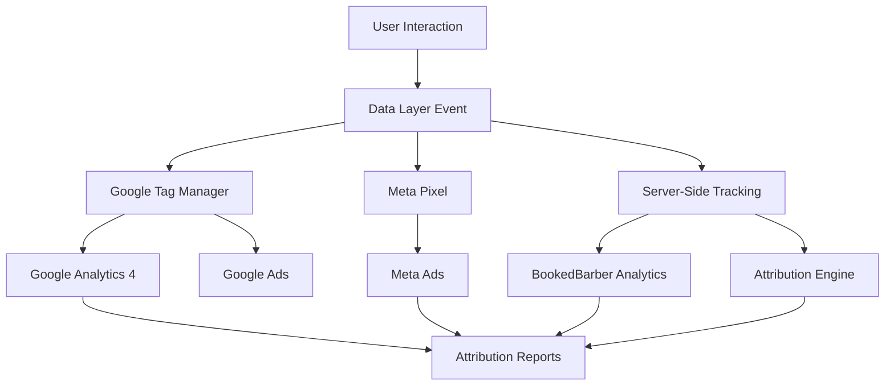

# Conversion Tracking Implementation Guide

## Overview

This guide provides comprehensive instructions for implementing conversion tracking in BookedBarber V2. The system tracks customer journeys from initial touchpoint through booking completion, enabling accurate ROI measurement and marketing optimization.

## Table of Contents

1. [Conversion Tracking Architecture](#conversion-tracking-architecture)
2. [Google Analytics 4 Setup](#google-analytics-4-setup)
3. [Google Tag Manager Implementation](#google-tag-manager-implementation)
4. [Meta Pixel Configuration](#meta-pixel-configuration)
5. [Enhanced Ecommerce Tracking](#enhanced-ecommerce-tracking)
6. [Custom Event Configuration](#custom-event-configuration)
7. [Server-Side Tracking](#server-side-tracking)
8. [Cross-Platform Attribution](#cross-platform-attribution)
9. [Data Layer Management](#data-layer-management)
10. [Testing & Validation](#testing--validation)
11. [Privacy & Compliance](#privacy--compliance)
12. [Performance Optimization](#performance-optimization)
13. [Troubleshooting](#troubleshooting)

## Conversion Tracking Architecture

### System Overview



### Core Components

1. **Data Layer**: Centralized event collection
2. **Tag Manager**: Event distribution and filtering
3. **Pixel Tracking**: Platform-specific conversion tracking
4. **Server-Side**: First-party data collection
5. **Attribution Engine**: Cross-platform attribution modeling

## Google Analytics 4 Setup

### 1. Create GA4 Property

```javascript
// GA4 Configuration
gtag('config', 'G-XXXXXXXXXX', {
  // Basic configuration
  page_title: document.title,
  page_location: window.location.href,
  
  // Enhanced ecommerce
  currency: 'USD',
  country: 'US',
  
  // Custom parameters
  business_type: 'barbershop',
  booking_platform: 'bookedbarber_v2'
});
```

### 2. Enhanced Ecommerce Events

```javascript
// Purchase Event (Booking Completion)
gtag('event', 'purchase', {
  transaction_id: 'booking_123456',
  value: 75.00,
  currency: 'USD',
  items: [
    {
      item_id: 'service_haircut_premium',
      item_name: 'Premium Haircut',
      item_category: 'Haircut Services',
      item_category2: 'Premium',
      price: 45.00,
      quantity: 1
    },
    {
      item_id: 'service_beard_trim',
      item_name: 'Beard Trim',
      item_category: 'Grooming Services',
      item_category2: 'Add-on',
      price: 30.00,
      quantity: 1
    }
  ],
  // Custom parameters
  barber_id: 'barber_456',
  location_id: 'location_789',
  booking_source: 'website',
  customer_type: 'returning'
});

// Begin Checkout (Booking Form Started)
gtag('event', 'begin_checkout', {
  currency: 'USD',
  value: 75.00,
  items: [...], // Same items array
  // Custom parameters
  checkout_step: 1,
  checkout_option: 'booking_form'
});

// Add to Cart (Service Selected)
gtag('event', 'add_to_cart', {
  currency: 'USD',
  value: 45.00,
  items: [
    {
      item_id: 'service_haircut_premium',
      item_name: 'Premium Haircut',
      item_category: 'Haircut Services',
      price: 45.00,
      quantity: 1
    }
  ]
});

// View Item (Service Page)
gtag('event', 'view_item', {
  currency: 'USD',
  value: 45.00,
  items: [...]
});
```

### 3. Custom Events

```javascript
// Booking Flow Events
gtag('event', 'select_barber', {
  barber_id: 'barber_456',
  barber_name: 'John Smith',
  specialty: 'Fades'
});

gtag('event', 'select_time_slot', {
  selected_date: '2024-01-20',
  selected_time: '14:00',
  time_slot_id: 'slot_123'
});

gtag('event', 'form_submit', {
  form_name: 'booking_form',
  form_step: 'customer_details'
});

// Engagement Events
gtag('event', 'scroll', {
  percent_scrolled: 75
});

gtag('event', 'video_play', {
  video_title: 'Barbershop Tour',
  video_duration: 120
});
```

## Google Tag Manager Implementation

### 1. Container Setup

```html
<!-- GTM Head -->
<script>(function(w,d,s,l,i){w[l]=w[l]||[];w[l].push({'gtm.start':
new Date().getTime(),event:'gtm.js'});var f=d.getElementsByTagName(s)[0],
j=d.createElement(s),dl=l!='dataLayer'?'&l='+l:'';j.async=true;j.src=
'https://www.googletagmanager.com/gtm.js?id='+i+dl;f.parentNode.insertBefore(j,f);
})(window,document,'script','dataLayer','GTM-XXXXXXX');</script>

<!-- GTM Body -->
<noscript><iframe src="https://www.googletagmanager.com/ns.html?id=GTM-XXXXXXX"
height="0" width="0" style="display:none;visibility:hidden"></iframe></noscript>
```

### 2. Data Layer Structure

```javascript
// Initialize data layer
window.dataLayer = window.dataLayer || [];

// Page data
window.dataLayer.push({
  'event': 'page_view',
  'page_type': 'booking_page',
  'page_category': 'booking',
  'user_type': 'anonymous', // or 'logged_in'
  'location_id': 'location_123',
  'location_name': 'Downtown Barbershop'
});

// Booking events
window.dataLayer.push({
  'event': 'booking_started',
  'booking_id': 'booking_123456',
  'services': [
    {
      'service_id': 'service_haircut_premium',
      'service_name': 'Premium Haircut',
      'service_price': 45.00,
      'service_category': 'Haircut'
    }
  ],
  'total_value': 75.00,
  'currency': 'USD',
  'barber_id': 'barber_456',
  'booking_date': '2024-01-20',
  'booking_time': '14:00'
});
```

### 3. GTM Tags Configuration

#### GA4 Configuration Tag
```javascript
// Tag Type: Google Analytics: GA4 Configuration
// Configuration settings:
{
  'measurement_id': 'G-XXXXXXXXXX',
  'fields_to_set': {
    'custom_map.booking_id': 'booking_id',
    'custom_map.barber_id': 'barber_id',
    'custom_map.location_id': 'location_id'
  },
  'custom_parameters': {
    'business_type': 'barbershop',
    'platform_version': 'v2'
  }
}
```

#### Purchase Event Tag
```javascript
// Tag Type: Google Analytics: GA4 Event
// Event Name: purchase
// Parameters:
{
  'transaction_id': '{{DLV - booking_id}}',
  'value': '{{DLV - total_value}}',
  'currency': '{{DLV - currency}}',
  'items': '{{DLV - services}}', // Custom variable
  'barber_id': '{{DLV - barber_id}}',
  'location_id': '{{DLV - location_id}}',
  'booking_source': '{{DLV - booking_source}}'
}
```

### 4. Triggers Configuration

```javascript
// Purchase Trigger
{
  'trigger_type': 'Custom Event',
  'event_name': 'booking_completed',
  'conditions': [
    {
      'variable': '{{DLV - booking_id}}',
      'operator': 'is not empty'
    }
  ]
}

// Form Submission Trigger
{
  'trigger_type': 'Form Submission',
  'form_classes': 'booking-form',
  'check_validation': true
}
```

## Meta Pixel Configuration

### 1. Pixel Base Code

```javascript
// Meta Pixel Base Code
!function(f,b,e,v,n,t,s)
{if(f.fbq)return;n=f.fbq=function(){n.callMethod?
n.callMethod.apply(n,arguments):n.queue.push(arguments)};
if(!f._fbq)f._fbq=n;n.push=n;n.loaded=!0;n.version='2.0';
n.queue=[];t=b.createElement(e);t.async=!0;
t.src=v;s=b.getElementsByTagName(e)[0];
s.parentNode.insertBefore(t,s)}(window, document,'script',
'https://connect.facebook.net/en_US/fbevents.js');

fbq('init', '1234567890'); // Your Pixel ID
fbq('track', 'PageView');
```

### 2. Advanced Matching

```javascript
// Initialize with advanced matching
fbq('init', '1234567890', {
  em: 'customer_email_hash', // SHA-256 hashed email
  fn: 'customer_first_name_hash',
  ln: 'customer_last_name_hash',
  ph: 'customer_phone_hash',
  ct: 'customer_city_hash',
  st: 'customer_state_hash',
  zp: 'customer_zip_hash',
  country: 'customer_country_hash'
});
```

### 3. Standard Events

```javascript
// Purchase Event
fbq('track', 'Purchase', {
  value: 75.00,
  currency: 'USD',
  content_ids: ['service_haircut_premium', 'service_beard_trim'],
  content_name: 'Premium Haircut + Beard Trim',
  content_category: 'Barbershop Services',
  content_type: 'product',
  contents: [
    {
      'id': 'service_haircut_premium',
      'quantity': 1,
      'item_price': 45.00
    },
    {
      'id': 'service_beard_trim',
      'quantity': 1,
      'item_price': 30.00
    }
  ]
});

// Initiate Checkout
fbq('track', 'InitiateCheckout', {
  value: 75.00,
  currency: 'USD',
  content_ids: ['service_haircut_premium', 'service_beard_trim'],
  content_name: 'Premium Haircut + Beard Trim',
  content_category: 'Barbershop Services',
  num_items: 2
});

// Add to Cart
fbq('track', 'AddToCart', {
  value: 45.00,
  currency: 'USD',
  content_ids: ['service_haircut_premium'],
  content_name: 'Premium Haircut',
  content_category: 'Haircut Services'
});

// View Content
fbq('track', 'ViewContent', {
  value: 45.00,
  currency: 'USD',
  content_ids: ['service_haircut_premium'],
  content_name: 'Premium Haircut',
  content_category: 'Haircut Services'
});
```

### 4. Custom Events

```javascript
// Custom Booking Events
fbq('trackCustom', 'BookingStarted', {
  booking_id: 'booking_123456',
  barber_name: 'John Smith',
  service_category: 'Haircut',
  booking_date: '2024-01-20'
});

fbq('trackCustom', 'BarberSelected', {
  barber_id: 'barber_456',
  barber_name: 'John Smith',
  specialty: 'Fades'
});

fbq('trackCustom', 'TimeSlotSelected', {
  selected_date: '2024-01-20',
  selected_time: '14:00',
  barber_id: 'barber_456'
});
```

## Enhanced Ecommerce Tracking

### 1. Product Catalog Setup

```javascript
// Service catalog structure
const servicesCatalog = {
  'service_haircut_premium': {
    item_id: 'service_haircut_premium',
    item_name: 'Premium Haircut',
    item_category: 'Haircut Services',
    item_category2: 'Premium',
    item_brand: 'BookedBarber',
    price: 45.00,
    item_variant: 'Premium',
    promotion_id: 'NEWCUSTOMER20',
    promotion_name: 'New Customer 20% Off',
    creative_name: 'Premium Haircut Hero',
    creative_slot: 'hero_banner',
    location_id: 'location_123'
  }
};
```

### 2. Shopping Behavior Tracking

```javascript
// View Item List (Services Page)
gtag('event', 'view_item_list', {
  item_list_id: 'haircut_services',
  item_list_name: 'Haircut Services',
  items: [
    {
      item_id: 'service_haircut_basic',
      item_name: 'Basic Haircut',
      item_category: 'Haircut Services',
      item_list_id: 'haircut_services',
      item_list_name: 'Haircut Services',
      index: 1,
      price: 25.00
    },
    {
      item_id: 'service_haircut_premium',
      item_name: 'Premium Haircut',
      item_category: 'Haircut Services',
      item_list_id: 'haircut_services',
      item_list_name: 'Haircut Services',
      index: 2,
      price: 45.00
    }
  ]
});

// Select Item (Service Selected)
gtag('event', 'select_item', {
  item_list_id: 'haircut_services',
  item_list_name: 'Haircut Services',
  items: [
    {
      item_id: 'service_haircut_premium',
      item_name: 'Premium Haircut',
      item_category: 'Haircut Services',
      index: 2,
      price: 45.00
    }
  ]
});
```

### 3. Checkout Process Tracking

```javascript
// Checkout Progress
const checkoutSteps = {
  1: 'service_selection',
  2: 'barber_selection',
  3: 'time_selection',
  4: 'customer_details',
  5: 'payment_details',
  6: 'booking_confirmation'
};

// Track checkout step
function trackCheckoutStep(step, option = '') {
  gtag('event', 'checkout_progress', {
    checkout_step: step,
    checkout_option: option,
    currency: 'USD',
    value: getCurrentBookingValue(),
    items: getCurrentBookingItems()
  });
}

// Add Payment Info
gtag('event', 'add_payment_info', {
  currency: 'USD',
  value: 75.00,
  payment_type: 'credit_card',
  items: getCurrentBookingItems()
});
```

## Custom Event Configuration

### 1. Business-Specific Events

```javascript
// Loyalty Program Events
gtag('event', 'loyalty_signup', {
  method: 'booking_flow',
  customer_id: 'customer_123',
  signup_source: 'checkout_page'
});

gtag('event', 'loyalty_points_earned', {
  points_earned: 75,
  points_balance: 150,
  transaction_id: 'booking_123456'
});

// Referral Events
gtag('event', 'referral_sent', {
  referrer_id: 'customer_123',
  referral_method: 'sms'
});

gtag('event', 'referral_conversion', {
  referrer_id: 'customer_123',
  referred_id: 'customer_456',
  referral_value: 75.00
});
```

### 2. Engagement Events

```javascript
// Time-based engagement
gtag('event', 'session_engaged', {
  engagement_time_msec: 30000, // 30 seconds
  page_type: 'booking_page'
});

// Social sharing
gtag('event', 'share', {
  method: 'facebook',
  content_type: 'booking_page',
  content_id: 'booking_123456'
});

// Review submission
gtag('event', 'review_submitted', {
  rating: 5,
  review_length: 150,
  booking_id: 'booking_123456'
});
```

### 3. Lead Generation Events

```javascript
// Lead generation
gtag('event', 'generate_lead', {
  currency: 'USD',
  value: 75.00,
  lead_source: 'booking_form',
  lead_type: 'booking_inquiry'
});

// Contact form submission
gtag('event', 'contact_form_submit', {
  form_name: 'contact_form',
  inquiry_type: 'booking_question'
});
```

## Server-Side Tracking

### 1. Server-Side GA4 Implementation

```python
# Install Google Analytics Measurement Protocol
pip install google-analytics-data

# Server-side event tracking
from google.analytics.data_v1beta import BetaAnalyticsDataClient
from google.analytics.data_v1beta.types import RunReportRequest
import requests
import json

class ServerSideTracking:
    def __init__(self, measurement_id: str, api_secret: str):
        self.measurement_id = measurement_id
        self.api_secret = api_secret
        self.endpoint = f"https://www.google-analytics.com/mp/collect?measurement_id={measurement_id}&api_secret={api_secret}"
    
    def track_event(self, client_id: str, event_name: str, parameters: dict):
        """Send event to GA4 via Measurement Protocol"""
        payload = {
            "client_id": client_id,
            "events": [
                {
                    "name": event_name,
                    "parameters": parameters
                }
            ]
        }
        
        response = requests.post(
            self.endpoint,
            data=json.dumps(payload),
            headers={"Content-Type": "application/json"}
        )
        
        return response.status_code == 204
    
    def track_purchase(self, client_id: str, transaction_id: str, 
                      value: float, currency: str, items: list):
        """Track purchase event server-side"""
        parameters = {
            "transaction_id": transaction_id,
            "value": value,
            "currency": currency,
            "items": items
        }
        
        return self.track_event(client_id, "purchase", parameters)

# Usage example
tracker = ServerSideTracking("G-XXXXXXXXXX", "your_api_secret")

# Track booking completion
tracker.track_purchase(
    client_id="client_123",
    transaction_id="booking_123456",
    value=75.00,
    currency="USD",
    items=[
        {
            "item_id": "service_haircut_premium",
            "item_name": "Premium Haircut",
            "item_category": "Haircut Services",
            "price": 45.00,
            "quantity": 1
        }
    ]
)
```

### 2. Server-Side Meta Conversions API

```python
# Install Meta Business SDK
pip install facebook-business

from facebook_business.api import FacebookAdsApi
from facebook_business.adobjects.serverside.event import Event
from facebook_business.adobjects.serverside.event_request import EventRequest
from facebook_business.adobjects.serverside.user_data import UserData
from facebook_business.adobjects.serverside.custom_data import CustomData
import hashlib

class MetaConversionsAPI:
    def __init__(self, access_token: str, pixel_id: str):
        self.access_token = access_token
        self.pixel_id = pixel_id
        FacebookAdsApi.init(access_token=access_token)
    
    def hash_data(self, data: str) -> str:
        """Hash data for advanced matching"""
        return hashlib.sha256(data.lower().encode()).hexdigest()
    
    def track_purchase(self, user_data: dict, purchase_data: dict):
        """Track purchase via Conversions API"""
        # Create user data
        user_data_obj = UserData(
            email=self.hash_data(user_data.get('email', '')),
            phone=self.hash_data(user_data.get('phone', '')),
            first_name=self.hash_data(user_data.get('first_name', '')),
            last_name=self.hash_data(user_data.get('last_name', '')),
            city=self.hash_data(user_data.get('city', '')),
            state=self.hash_data(user_data.get('state', '')),
            zip_code=self.hash_data(user_data.get('zip_code', '')),
            country=self.hash_data(user_data.get('country', ''))
        )
        
        # Create custom data
        custom_data = CustomData(
            currency=purchase_data.get('currency', 'USD'),
            value=purchase_data.get('value', 0),
            content_ids=purchase_data.get('content_ids', []),
            content_type='product',
            content_name=purchase_data.get('content_name', ''),
            content_category=purchase_data.get('content_category', '')
        )
        
        # Create event
        event = Event(
            event_name='Purchase',
            event_time=int(time.time()),
            user_data=user_data_obj,
            custom_data=custom_data,
            event_source_url=purchase_data.get('source_url', ''),
            action_source='website'
        )
        
        # Send event
        event_request = EventRequest(
            events=[event],
            pixel_id=self.pixel_id
        )
        
        response = event_request.execute()
        return response

# Usage
meta_api = MetaConversionsAPI("your_access_token", "1234567890")

meta_api.track_purchase(
    user_data={
        'email': 'customer@example.com',
        'phone': '+1234567890',
        'first_name': 'John',
        'last_name': 'Doe'
    },
    purchase_data={
        'value': 75.00,
        'currency': 'USD',
        'content_ids': ['service_haircut_premium'],
        'content_name': 'Premium Haircut',
        'content_category': 'Haircut Services'
    }
)
```

## Cross-Platform Attribution

### 1. Attribution Model Configuration

```python
# Attribution engine
class AttributionEngine:
    def __init__(self):
        self.attribution_models = {
            'first_touch': self.first_touch_attribution,
            'last_touch': self.last_touch_attribution,
            'linear': self.linear_attribution,
            'time_decay': self.time_decay_attribution,
            'position_based': self.position_based_attribution
        }
    
    def first_touch_attribution(self, touchpoints):
        """First touch attribution model"""
        if not touchpoints:
            return {}
        
        first_touch = touchpoints[0]
        return {
            first_touch['channel']: {
                'credit': 1.0,
                'value': first_touch['conversion_value']
            }
        }
    
    def last_touch_attribution(self, touchpoints):
        """Last touch attribution model"""
        if not touchpoints:
            return {}
        
        last_touch = touchpoints[-1]
        return {
            last_touch['channel']: {
                'credit': 1.0,
                'value': last_touch['conversion_value']
            }
        }
    
    def linear_attribution(self, touchpoints):
        """Linear attribution model"""
        if not touchpoints:
            return {}
        
        credit_per_touch = 1.0 / len(touchpoints)
        attribution = {}
        
        for touch in touchpoints:
            channel = touch['channel']
            if channel not in attribution:
                attribution[channel] = {'credit': 0, 'value': 0}
            
            attribution[channel]['credit'] += credit_per_touch
            attribution[channel]['value'] += touch['conversion_value'] * credit_per_touch
        
        return attribution
    
    def time_decay_attribution(self, touchpoints, decay_rate=0.7):
        """Time decay attribution model"""
        if not touchpoints:
            return {}
        
        weights = []
        for i, touch in enumerate(touchpoints):
            # More recent touchpoints get higher weight
            weight = decay_rate ** (len(touchpoints) - i - 1)
            weights.append(weight)
        
        total_weight = sum(weights)
        attribution = {}
        
        for i, touch in enumerate(touchpoints):
            channel = touch['channel']
            credit = weights[i] / total_weight
            
            if channel not in attribution:
                attribution[channel] = {'credit': 0, 'value': 0}
            
            attribution[channel]['credit'] += credit
            attribution[channel]['value'] += touch['conversion_value'] * credit
        
        return attribution
    
    def position_based_attribution(self, touchpoints, 
                                 first_weight=0.4, last_weight=0.4):
        """Position-based (U-shaped) attribution model"""
        if not touchpoints:
            return {}
        
        if len(touchpoints) == 1:
            return self.first_touch_attribution(touchpoints)
        
        attribution = {}
        middle_weight = (1.0 - first_weight - last_weight) / (len(touchpoints) - 2) if len(touchpoints) > 2 else 0
        
        for i, touch in enumerate(touchpoints):
            channel = touch['channel']
            
            if i == 0:  # First touch
                credit = first_weight
            elif i == len(touchpoints) - 1:  # Last touch
                credit = last_weight
            else:  # Middle touches
                credit = middle_weight
            
            if channel not in attribution:
                attribution[channel] = {'credit': 0, 'value': 0}
            
            attribution[channel]['credit'] += credit
            attribution[channel]['value'] += touch['conversion_value'] * credit
        
        return attribution
```

### 2. Touchpoint Tracking

```python
# Customer journey tracking
class CustomerJourney:
    def __init__(self, customer_id: str):
        self.customer_id = customer_id
        self.touchpoints = []
    
    def add_touchpoint(self, channel: str, source: str, medium: str, 
                      campaign: str, timestamp: datetime, value: float = 0):
        """Add a touchpoint to the customer journey"""
        touchpoint = {
            'customer_id': self.customer_id,
            'channel': channel,
            'source': source,
            'medium': medium,
            'campaign': campaign,
            'timestamp': timestamp,
            'value': value,
            'conversion_value': 0  # Set when conversion occurs
        }
        self.touchpoints.append(touchpoint)
    
    def mark_conversion(self, conversion_value: float):
        """Mark the journey as converted and set conversion value"""
        for touchpoint in self.touchpoints:
            touchpoint['conversion_value'] = conversion_value
    
    def get_attribution(self, model: str = 'linear'):
        """Get attribution for the customer journey"""
        engine = AttributionEngine()
        return engine.attribution_models[model](self.touchpoints)

# Usage example
journey = CustomerJourney("customer_123")

# Add touchpoints
journey.add_touchpoint(
    channel='google_ads',
    source='google',
    medium='cpc',
    campaign='haircut_campaign',
    timestamp=datetime.now() - timedelta(days=3)
)

journey.add_touchpoint(
    channel='facebook_ads',
    source='facebook.com',
    medium='social',
    campaign='premium_services',
    timestamp=datetime.now() - timedelta(days=1)
)

# Mark conversion
journey.mark_conversion(75.00)

# Get attribution
attribution = journey.get_attribution('position_based')
print(attribution)
# {'google_ads': {'credit': 0.4, 'value': 30.0}, 'facebook_ads': {'credit': 0.4, 'value': 30.0}}
```

## Data Layer Management

### 1. Data Layer Implementation

```javascript
// Data Layer Manager
class DataLayerManager {
    constructor() {
        this.dataLayer = window.dataLayer || [];
        this.initialize();
    }
    
    initialize() {
        // Set up data layer with initial data
        this.push({
            'event': 'gtm.js',
            'gtm.start': new Date().getTime(),
            'gtm.uniqueEventId': 0
        });
    }
    
    push(data) {
        this.dataLayer.push(data);
    }
    
    // Booking-specific methods
    trackBookingStarted(bookingData) {
        this.push({
            'event': 'booking_started',
            'booking_id': bookingData.id,
            'services': bookingData.services,
            'total_value': bookingData.total,
            'currency': bookingData.currency,
            'barber_id': bookingData.barber_id,
            'location_id': bookingData.location_id
        });
    }
    
    trackServiceSelected(serviceData) {
        this.push({
            'event': 'service_selected',
            'service_id': serviceData.id,
            'service_name': serviceData.name,
            'service_price': serviceData.price,
            'service_category': serviceData.category
        });
    }
    
    trackBarberSelected(barberData) {
        this.push({
            'event': 'barber_selected',
            'barber_id': barberData.id,
            'barber_name': barberData.name,
            'barber_specialty': barberData.specialty,
            'barber_rating': barberData.rating
        });
    }
    
    trackTimeSlotSelected(slotData) {
        this.push({
            'event': 'time_slot_selected',
            'selected_date': slotData.date,
            'selected_time': slotData.time,
            'slot_id': slotData.id,
            'time_preference': slotData.preference
        });
    }
    
    trackBookingCompleted(bookingData) {
        this.push({
            'event': 'booking_completed',
            'transaction_id': bookingData.id,
            'value': bookingData.total,
            'currency': bookingData.currency,
            'items': bookingData.services.map(service => ({
                'item_id': service.id,
                'item_name': service.name,
                'item_category': service.category,
                'price': service.price,
                'quantity': 1
            })),
            'barber_id': bookingData.barber_id,
            'location_id': bookingData.location_id,
            'customer_type': bookingData.customer_type,
            'booking_source': bookingData.source
        });
    }
    
    trackFormStep(stepData) {
        this.push({
            'event': 'form_step_completed',
            'form_name': stepData.form_name,
            'step_number': stepData.step_number,
            'step_name': stepData.step_name,
            'completion_time': stepData.completion_time
        });
    }
    
    trackError(errorData) {
        this.push({
            'event': 'error_occurred',
            'error_type': errorData.type,
            'error_message': errorData.message,
            'error_location': errorData.location,
            'user_action': errorData.user_action
        });
    }
}

// Global instance
window.dlm = new DataLayerManager();
```

### 2. React Integration

```typescript
// React hook for tracking
import { useEffect, useCallback } from 'react';

interface TrackingData {
    event: string;
    [key: string]: any;
}

export const useTracking = () => {
    const track = useCallback((data: TrackingData) => {
        if (typeof window !== 'undefined' && window.dlm) {
            window.dlm.push(data);
        }
    }, []);
    
    const trackPageView = useCallback((pageName: string, pageData?: any) => {
        track({
            event: 'page_view',
            page_name: pageName,
            page_type: pageData?.type || 'unknown',
            page_category: pageData?.category || 'general',
            ...pageData
        });
    }, [track]);
    
    const trackBookingEvent = useCallback((eventName: string, eventData: any) => {
        track({
            event: eventName,
            ...eventData
        });
    }, [track]);
    
    return {
        track,
        trackPageView,
        trackBookingEvent
    };
};

// Usage in React component
const BookingPage = () => {
    const { trackPageView, trackBookingEvent } = useTracking();
    
    useEffect(() => {
        trackPageView('booking_page', {
            type: 'booking',
            category: 'conversion'
        });
    }, [trackPageView]);
    
    const handleServiceSelect = (service: Service) => {
        trackBookingEvent('service_selected', {
            service_id: service.id,
            service_name: service.name,
            service_price: service.price,
            service_category: service.category
        });
    };
    
    return (
        <div>
            {/* Booking form components */}
        </div>
    );
};
```

## Testing & Validation

### 1. Google Tag Assistant

```javascript
// Testing script for GTM
const testGTM = () => {
    // Check if GTM is loaded
    if (typeof window.google_tag_manager === 'undefined') {
        console.error('GTM not loaded');
        return false;
    }
    
    // Check data layer
    console.log('DataLayer:', window.dataLayer);
    
    // Test event firing
    window.dataLayer.push({
        'event': 'test_event',
        'test_parameter': 'test_value'
    });
    
    console.log('Test event fired');
    return true;
};

// Run test
testGTM();
```

### 2. Meta Pixel Helper

```javascript
// Test Meta Pixel
const testMetaPixel = () => {
    // Check if pixel is loaded
    if (typeof window.fbq === 'undefined') {
        console.error('Meta Pixel not loaded');
        return false;
    }
    
    // Test event
    fbq('track', 'PageView');
    console.log('Meta Pixel PageView tracked');
    
    // Test custom event
    fbq('trackCustom', 'TestEvent', {
        test_parameter: 'test_value'
    });
    console.log('Meta Pixel custom event tracked');
    
    return true;
};

// Run test
testMetaPixel();
```

### 3. Server-Side Validation

```python
# Validation script
import requests
import json

def validate_ga4_tracking():
    """Validate GA4 server-side tracking"""
    # Test measurement protocol
    measurement_id = "G-XXXXXXXXXX"
    api_secret = "your_api_secret"
    
    payload = {
        "client_id": "test_client_123",
        "events": [
            {
                "name": "test_event",
                "parameters": {
                    "test_parameter": "test_value"
                }
            }
        ]
    }
    
    response = requests.post(
        f"https://www.google-analytics.com/debug/mp/collect?measurement_id={measurement_id}&api_secret={api_secret}",
        data=json.dumps(payload),
        headers={"Content-Type": "application/json"}
    )
    
    if response.status_code == 200:
        print("GA4 validation passed")
        print(response.json())
    else:
        print(f"GA4 validation failed: {response.status_code}")
        print(response.text)

def validate_meta_conversions():
    """Validate Meta Conversions API"""
    # Test with test event code
    pixel_id = "1234567890"
    access_token = "your_access_token"
    
    payload = {
        "data": [
            {
                "event_name": "Purchase",
                "event_time": int(time.time()),
                "action_source": "website",
                "user_data": {
                    "em": ["test@example.com"]
                },
                "custom_data": {
                    "currency": "USD",
                    "value": 75.00
                }
            }
        ],
        "test_event_code": "TEST12345"
    }
    
    response = requests.post(
        f"https://graph.facebook.com/v18.0/{pixel_id}/events",
        data=json.dumps(payload),
        headers={
            "Authorization": f"Bearer {access_token}",
            "Content-Type": "application/json"
        }
    )
    
    if response.status_code == 200:
        print("Meta Conversions validation passed")
        print(response.json())
    else:
        print(f"Meta Conversions validation failed: {response.status_code}")
        print(response.text)

# Run validations
validate_ga4_tracking()
validate_meta_conversions()
```

## Privacy & Compliance

### 1. Consent Management

```javascript
// Consent management system
class ConsentManager {
    constructor() {
        this.consentKey = 'user_consent';
        this.consentData = this.loadConsent();
        this.initialize();
    }
    
    initialize() {
        // Show consent banner if no consent given
        if (!this.hasConsent()) {
            this.showConsentBanner();
        } else {
            this.enableTracking();
        }
    }
    
    hasConsent() {
        return this.consentData && this.consentData.analytics === true;
    }
    
    grantConsent(categories) {
        this.consentData = {
            analytics: categories.includes('analytics'),
            marketing: categories.includes('marketing'),
            preferences: categories.includes('preferences'),
            timestamp: new Date().toISOString()
        };
        
        this.saveConsent();
        this.enableTracking();
        this.hideConsentBanner();
    }
    
    revokeConsent() {
        this.consentData = null;
        this.saveConsent();
        this.disableTracking();
        this.showConsentBanner();
    }
    
    enableTracking() {
        if (this.consentData.analytics) {
            // Enable GA4
            gtag('consent', 'update', {
                'analytics_storage': 'granted'
            });
            
            // Enable Meta Pixel
            if (typeof fbq !== 'undefined') {
                fbq('consent', 'grant');
            }
        }
        
        if (this.consentData.marketing) {
            gtag('consent', 'update', {
                'ad_storage': 'granted'
            });
        }
    }
    
    disableTracking() {
        // Disable GA4
        gtag('consent', 'update', {
            'analytics_storage': 'denied',
            'ad_storage': 'denied'
        });
        
        // Disable Meta Pixel
        if (typeof fbq !== 'undefined') {
            fbq('consent', 'revoke');
        }
    }
    
    saveConsent() {
        localStorage.setItem(this.consentKey, JSON.stringify(this.consentData));
    }
    
    loadConsent() {
        const saved = localStorage.getItem(this.consentKey);
        return saved ? JSON.parse(saved) : null;
    }
    
    showConsentBanner() {
        // Implementation depends on your UI framework
        document.getElementById('consent-banner').style.display = 'block';
    }
    
    hideConsentBanner() {
        document.getElementById('consent-banner').style.display = 'none';
    }
}

// Initialize consent manager
const consentManager = new ConsentManager();
```

### 2. Data Minimization

```javascript
// Data minimization utilities
const DataMinimizer = {
    // Hash PII data
    hashPII(data) {
        if (!data) return '';
        // Use SHA-256 for hashing
        return crypto.subtle.digest('SHA-256', new TextEncoder().encode(data))
            .then(hash => Array.from(new Uint8Array(hash))
                .map(b => b.toString(16).padStart(2, '0')).join(''));
    },
    
    // Anonymize IP addresses
    anonymizeIP(ip) {
        if (!ip) return '';
        const parts = ip.split('.');
        if (parts.length === 4) {
            // IPv4 - zero out last octet
            return parts.slice(0, 3).join('.') + '.0';
        }
        // IPv6 - zero out last 64 bits
        return ip.split(':').slice(0, 4).join(':') + '::';
    },
    
    // Remove sensitive parameters
    sanitizeURL(url) {
        const urlObj = new URL(url);
        const sensitiveParams = ['email', 'phone', 'name', 'address'];
        
        sensitiveParams.forEach(param => {
            urlObj.searchParams.delete(param);
        });
        
        return urlObj.toString();
    }
};
```

## Performance Optimization

### 1. Lazy Loading

```javascript
// Lazy load tracking scripts
const LazyTracker = {
    loaded: false,
    
    init() {
        // Load tracking scripts only when needed
        if ('IntersectionObserver' in window) {
            this.observeElements();
        } else {
            this.loadTracking();
        }
    },
    
    observeElements() {
        const observer = new IntersectionObserver((entries) => {
            entries.forEach(entry => {
                if (entry.isIntersecting && !this.loaded) {
                    this.loadTracking();
                    observer.disconnect();
                }
            });
        });
        
        // Observe key elements
        const trackingTriggers = document.querySelectorAll('[data-track]');
        trackingTriggers.forEach(el => observer.observe(el));
    },
    
    loadTracking() {
        if (this.loaded) return;
        
        // Load GTM
        this.loadGTM();
        
        // Load Meta Pixel
        this.loadMetaPixel();
        
        this.loaded = true;
    },
    
    loadGTM() {
        const script = document.createElement('script');
        script.src = 'https://www.googletagmanager.com/gtm.js?id=GTM-XXXXXXX';
        script.async = true;
        document.head.appendChild(script);
    },
    
    loadMetaPixel() {
        const script = document.createElement('script');
        script.src = 'https://connect.facebook.net/en_US/fbevents.js';
        script.async = true;
        document.head.appendChild(script);
    }
};

// Initialize lazy tracker
LazyTracker.init();
```

### 2. Event Batching

```javascript
// Batch events for better performance
class EventBatcher {
    constructor(batchSize = 10, flushInterval = 5000) {
        this.batch = [];
        this.batchSize = batchSize;
        this.flushInterval = flushInterval;
        this.timer = null;
        this.startTimer();
    }
    
    add(event) {
        this.batch.push(event);
        
        if (this.batch.length >= this.batchSize) {
            this.flush();
        }
    }
    
    flush() {
        if (this.batch.length === 0) return;
        
        // Send batch to server
        this.sendBatch(this.batch);
        
        // Clear batch
        this.batch = [];
        
        // Reset timer
        this.resetTimer();
    }
    
    sendBatch(events) {
        fetch('/api/v1/tracking/batch', {
            method: 'POST',
            headers: {
                'Content-Type': 'application/json'
            },
            body: JSON.stringify({
                events: events,
                timestamp: new Date().toISOString()
            })
        }).catch(error => {
            console.error('Failed to send tracking batch:', error);
        });
    }
    
    startTimer() {
        this.timer = setInterval(() => {
            this.flush();
        }, this.flushInterval);
    }
    
    resetTimer() {
        if (this.timer) {
            clearInterval(this.timer);
            this.startTimer();
        }
    }
}

// Global event batcher
const eventBatcher = new EventBatcher();
```

## Troubleshooting

### Common Issues and Solutions

#### 1. Events Not Firing

```javascript
// Debug checklist
const debugTracking = () => {
    console.log('=== Tracking Debug ===');
    
    // Check if scripts are loaded
    console.log('GTM loaded:', typeof window.google_tag_manager !== 'undefined');
    console.log('Meta Pixel loaded:', typeof window.fbq !== 'undefined');
    console.log('GA4 loaded:', typeof window.gtag !== 'undefined');
    
    // Check data layer
    console.log('DataLayer length:', window.dataLayer ? window.dataLayer.length : 0);
    console.log('DataLayer content:', window.dataLayer);
    
    // Check for errors
    console.log('Console errors:', console.error.length);
    
    // Test event firing
    if (typeof window.gtag !== 'undefined') {
        gtag('event', 'debug_test', {
            'debug_parameter': 'test_value'
        });
        console.log('GA4 test event fired');
    }
    
    if (typeof window.fbq !== 'undefined') {
        fbq('trackCustom', 'DebugTest', {
            debug_parameter: 'test_value'
        });
        console.log('Meta Pixel test event fired');
    }
};

// Run debug
debugTracking();
```

#### 2. Server-Side Tracking Issues

```python
# Server-side debugging
import logging

logging.basicConfig(level=logging.DEBUG)
logger = logging.getLogger(__name__)

def debug_server_tracking():
    """Debug server-side tracking issues"""
    
    # Check environment variables
    required_vars = [
        'GA4_MEASUREMENT_ID',
        'GA4_API_SECRET',
        'META_PIXEL_ID',
        'META_ACCESS_TOKEN'
    ]
    
    for var in required_vars:
        value = os.getenv(var)
        if value:
            logger.debug(f"{var}: {'*' * len(value)}")
        else:
            logger.error(f"{var}: NOT SET")
    
    # Test API connections
    try:
        # Test GA4
        response = requests.get(
            f"https://www.google-analytics.com/debug/mp/collect?measurement_id={GA4_MEASUREMENT_ID}&api_secret={GA4_API_SECRET}",
            timeout=5
        )
        logger.debug(f"GA4 API response: {response.status_code}")
    except Exception as e:
        logger.error(f"GA4 API error: {e}")
    
    try:
        # Test Meta
        response = requests.get(
            f"https://graph.facebook.com/v18.0/{META_PIXEL_ID}",
            headers={"Authorization": f"Bearer {META_ACCESS_TOKEN}"},
            timeout=5
        )
        logger.debug(f"Meta API response: {response.status_code}")
    except Exception as e:
        logger.error(f"Meta API error: {e}")

# Run debug
debug_server_tracking()
```

#### 3. Attribution Discrepancies

```python
# Attribution debugging
def debug_attribution():
    """Debug attribution discrepancies"""
    
    # Check touchpoint data
    touchpoints = get_customer_touchpoints("customer_123")
    print(f"Touchpoints found: {len(touchpoints)}")
    
    for i, touch in enumerate(touchpoints):
        print(f"Touchpoint {i+1}: {touch['channel']} - {touch['timestamp']}")
    
    # Test different attribution models
    engine = AttributionEngine()
    
    for model_name in engine.attribution_models.keys():
        attribution = engine.attribution_models[model_name](touchpoints)
        print(f"\n{model_name.upper()} Attribution:")
        for channel, data in attribution.items():
            print(f"  {channel}: {data['credit']:.2%} credit, ${data['value']:.2f} value")
    
    # Check for common issues
    if len(touchpoints) == 0:
        print("❌ No touchpoints found - check tracking implementation")
    
    if len(set(t['customer_id'] for t in touchpoints)) > 1:
        print("❌ Multiple customer IDs in touchpoints - check ID consistency")
    
    if any(t['conversion_value'] == 0 for t in touchpoints):
        print("❌ Some touchpoints have zero conversion value - check conversion tracking")

# Run debug
debug_attribution()
```

## Best Practices Summary

1. **Implementation Order**:
   - Start with GA4 basic tracking
   - Add Meta Pixel
   - Implement enhanced ecommerce
   - Add server-side tracking
   - Set up attribution modeling

2. **Data Quality**:
   - Validate all tracking before launch
   - Use consistent event naming
   - Implement data validation
   - Monitor data quality regularly

3. **Performance**:
   - Lazy load tracking scripts
   - Batch events when possible
   - Optimize server-side calls
   - Cache attribution calculations

4. **Privacy**:
   - Implement consent management
   - Hash all PII data
   - Minimize data collection
   - Respect user preferences

5. **Testing**:
   - Test in staging environment
   - Use debug modes
   - Validate cross-platform consistency
   - Monitor real-time data

6. **Monitoring**:
   - Set up alerts for tracking failures
   - Monitor attribution discrepancies
   - Track performance metrics
   - Regular health checks

This comprehensive guide covers all aspects of conversion tracking implementation in BookedBarber V2. Follow these guidelines to ensure accurate, compliant, and performant tracking across all marketing channels.