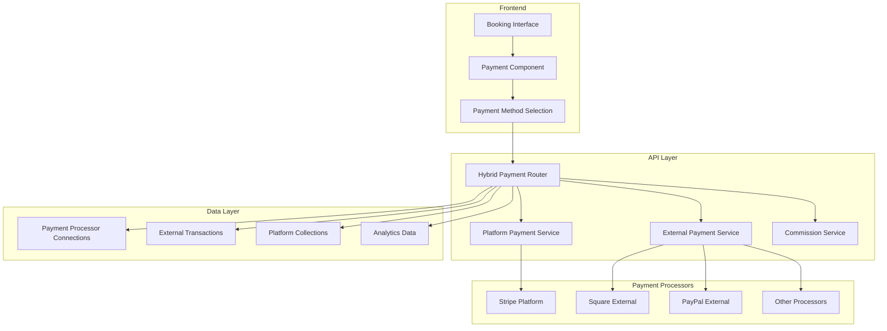
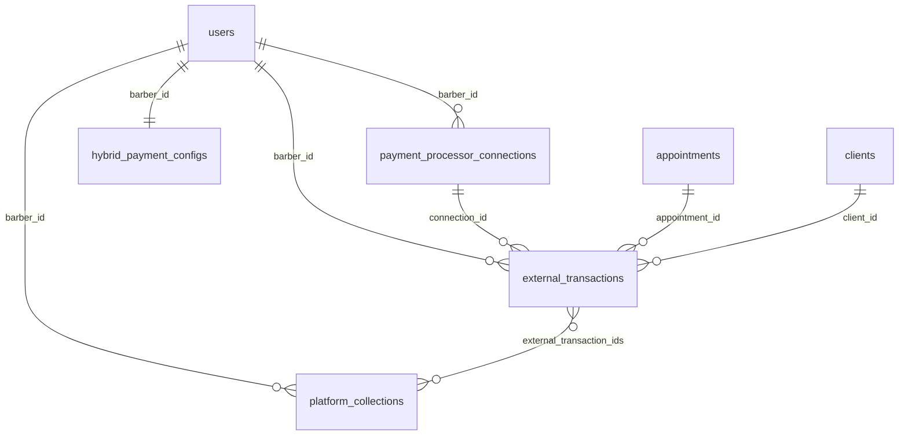
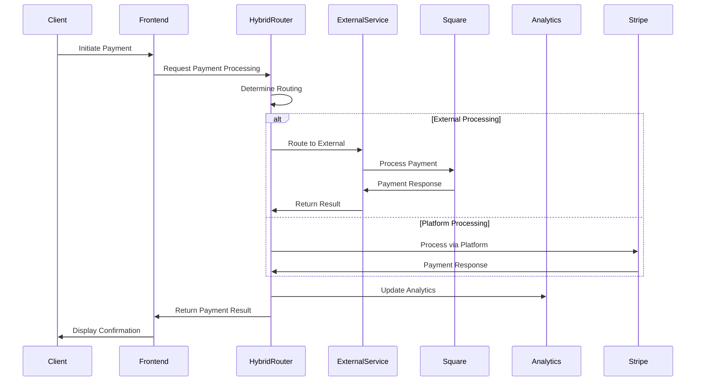
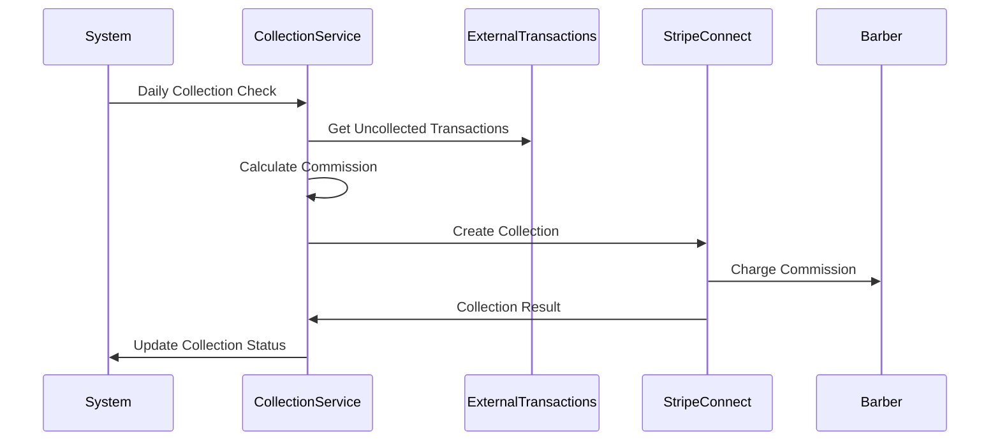

# 🏦 Hybrid Payment System - Complete Documentation

## 🎯 System Overview

The BookedBarber V2 Hybrid Payment System is a comprehensive solution that supports multiple payment processing modes to accommodate different business models and barber preferences. It seamlessly integrates centralized platform payments with decentralized external payment processors while maintaining unified analytics and commission collection.

### Key Features

- **Multi-Mode Support**: Centralized, Decentralized, and Hybrid payment processing
- **External Processor Integration**: Stripe, Square, PayPal, Clover, and more
- **Intelligent Routing**: Automatic payment routing based on barber configuration
- **Unified Analytics**: Combined analytics across all payment methods
- **Commission Collection**: Automated commission and fee collection system
- **Six Figure Barber Integration**: Built-in support for 6FB methodology
- **Fallback Mechanisms**: Automatic fallback to platform when external fails
- **Real-time Monitoring**: Live payment processing and health monitoring

## 🏗️ Architecture Overview

### System Components



### Payment Flow Architecture

1. **Payment Initiation**: Client initiates payment through booking interface
2. **Routing Decision**: HybridPaymentRouter determines optimal processing method
3. **Processing**: Payment processed through selected processor (platform or external)
4. **Commission Collection**: Automated commission calculation and collection
5. **Analytics**: Real-time analytics aggregation across all payment methods
6. **Reconciliation**: Automated transaction reconciliation and reporting

## 💾 Database Schema

### Core Tables

#### `payment_processor_connections`
Stores external payment processor connections for barbers.

```sql
CREATE TABLE payment_processor_connections (
    id INTEGER PRIMARY KEY,
    barber_id INTEGER REFERENCES users(id),
    processor_type VARCHAR(50) NOT NULL, -- stripe, square, paypal, etc.
    account_id VARCHAR(255) NOT NULL,    -- External account identifier
    account_name VARCHAR(255),           -- Display name
    status VARCHAR(50) DEFAULT 'pending', -- pending, connected, expired, etc.
    
    -- Connection data (encrypted)
    connection_data JSON,                -- OAuth tokens, API keys
    webhook_url VARCHAR(500),            -- Webhook endpoint
    webhook_secret VARCHAR(255),         -- Webhook signature secret
    
    -- Capabilities
    supports_payments BOOLEAN DEFAULT true,
    supports_refunds BOOLEAN DEFAULT true,
    supports_recurring BOOLEAN DEFAULT false,
    default_currency VARCHAR(3) DEFAULT 'USD',
    processing_fees JSON,               -- Fee structure
    
    -- Operational data
    last_sync_at TIMESTAMP,
    last_transaction_at TIMESTAMP,
    total_transactions INTEGER DEFAULT 0,
    total_volume DECIMAL(12,2) DEFAULT 0.00,
    
    -- Audit fields
    connected_at TIMESTAMP DEFAULT CURRENT_TIMESTAMP,
    disconnected_at TIMESTAMP,
    created_at TIMESTAMP DEFAULT CURRENT_TIMESTAMP,
    updated_at TIMESTAMP DEFAULT CURRENT_TIMESTAMP
);
```

#### `external_transactions`
Records all transactions processed through external payment processors.

```sql
CREATE TABLE external_transactions (
    id INTEGER PRIMARY KEY,
    connection_id INTEGER REFERENCES payment_processor_connections(id),
    processor_type VARCHAR(50) NOT NULL,
    external_transaction_id VARCHAR(255) NOT NULL,
    
    -- Transaction details
    amount DECIMAL(10,2) NOT NULL,
    currency VARCHAR(3) DEFAULT 'USD',
    status VARCHAR(50) NOT NULL,        -- pending, completed, failed, refunded
    
    -- BookedBarber context
    barber_id INTEGER REFERENCES users(id),
    appointment_id INTEGER REFERENCES appointments(id),
    client_id INTEGER REFERENCES clients(id),
    
    -- External processor data
    external_customer_id VARCHAR(255),
    external_metadata JSON,
    processor_fees DECIMAL(10,2),
    
    -- Reconciliation
    reconciled_at TIMESTAMP,
    reconciliation_status VARCHAR(50),
    
    -- Audit fields
    processed_at TIMESTAMP,
    created_at TIMESTAMP DEFAULT CURRENT_TIMESTAMP,
    updated_at TIMESTAMP DEFAULT CURRENT_TIMESTAMP,
    
    UNIQUE(processor_type, external_transaction_id)
);
```

#### `platform_collections`
Tracks commission and fee collections from decentralized barbers.

```sql
CREATE TABLE platform_collections (
    id INTEGER PRIMARY KEY,
    barber_id INTEGER REFERENCES users(id),
    
    -- Collection details
    amount DECIMAL(10,2) NOT NULL,
    collection_type VARCHAR(50) DEFAULT 'commission', -- commission, booth_rent, platform_fee
    status VARCHAR(50) DEFAULT 'pending',              -- pending, due, processing, collected, failed
    
    -- Related transactions
    external_transaction_ids JSON NOT NULL,           -- Array of transaction IDs
    commission_rate DECIMAL(5,2),                     -- Commission percentage
    
    -- Collection metadata
    due_date TIMESTAMP,
    collection_method VARCHAR(50),                    -- auto_debit, manual, stripe_connect
    
    -- Processing details
    stripe_invoice_id VARCHAR(255),
    payment_intent_id VARCHAR(255),
    collected_at TIMESTAMP,
    failed_reason TEXT,
    
    -- Audit fields
    created_at TIMESTAMP DEFAULT CURRENT_TIMESTAMP,
    updated_at TIMESTAMP DEFAULT CURRENT_TIMESTAMP
);
```

#### `hybrid_payment_configs`
Per-barber payment configuration and preferences.

```sql
CREATE TABLE hybrid_payment_configs (
    id INTEGER PRIMARY KEY,
    barber_id INTEGER REFERENCES users(id) UNIQUE,
    
    -- Payment mode configuration
    payment_mode VARCHAR(50) DEFAULT 'centralized',   -- centralized, decentralized, hybrid
    preferred_processor VARCHAR(50),                  -- Default external processor
    fallback_enabled BOOLEAN DEFAULT true,           -- Enable fallback to platform
    
    -- Business rules
    min_external_amount DECIMAL(10,2),               -- Minimum amount for external processing
    max_platform_amount DECIMAL(10,2),              -- Maximum amount for platform processing
    split_threshold DECIMAL(10,2),                  -- Amount threshold for split payments
    
    -- Commission settings
    commission_rate DECIMAL(5,2),                   -- Override default commission
    commission_collection_frequency VARCHAR(50),     -- daily, weekly, monthly
    auto_collection_enabled BOOLEAN DEFAULT true,
    
    -- Operational settings
    webhook_notifications BOOLEAN DEFAULT true,
    email_notifications BOOLEAN DEFAULT true,
    analytics_enabled BOOLEAN DEFAULT true,
    
    -- Audit fields
    effective_from TIMESTAMP DEFAULT CURRENT_TIMESTAMP,
    created_at TIMESTAMP DEFAULT CURRENT_TIMESTAMP,
    updated_at TIMESTAMP DEFAULT CURRENT_TIMESTAMP
);
```

### Table Relationships



## 🔄 Service Layer Architecture

### HybridPaymentRouter
**Location**: `services/hybrid_payment_router.py`

Central routing service that determines how payments should be processed.

```python
class HybridPaymentRouter:
    """Core payment routing service for the hybrid payment system."""
    
    def route_payment(self, appointment_id: int, amount: Decimal, 
                     currency: str = "USD") -> Tuple[PaymentRoutingDecision, Dict]:
        """Route payment based on barber's configuration and business rules."""
        
    def process_routed_payment(self, routing_decision: PaymentRoutingDecision,
                              routing_details: Dict) -> Dict:
        """Process payment using the determined routing decision."""
        
    def get_payment_options(self, barber_id: int) -> Dict:
        """Get available payment options for a barber."""
```

**Key Features**:
- Automatic routing based on barber payment mode
- Business rule evaluation for optimal processor selection
- Fallback mechanisms when external processors fail
- Real-time fee calculation and comparison

### ExternalPaymentService
**Location**: `services/external_payment_service.py`

Manages connections and transactions with external payment processors.

```python
class ExternalPaymentService:
    """Service for managing external payment processor integrations."""
    
    def create_connection(self, barber_id: int, processor_type: ExternalPaymentProcessor,
                         account_id: str, connection_config: Dict) -> PaymentProcessorConnection:
        """Create new external payment processor connection."""
        
    def process_payment(self, connection_id: int, amount: Decimal,
                       payment_method_data: Dict) -> Dict:
        """Process payment through external processor."""
        
    def sync_transactions(self, connection_id: int, 
                         since: datetime = None) -> List[ExternalTransaction]:
        """Sync transactions from external processor."""
```

**Key Features**:
- Multi-processor support (Stripe, Square, PayPal, Clover)
- Secure credential management with encryption
- Automatic transaction synchronization
- Webhook processing for real-time updates

### PlatformCollectionService
**Location**: `services/platform_collection_service.py`

Handles commission and fee collection from decentralized barbers.

```python
class PlatformCollectionService:
    """Service for collecting commissions from external payment processors."""
    
    def collect_commission(self, barber_id: int,
                          external_transaction_ids: List[str]) -> PlatformCollection:
        """Collect commission for external transactions."""
        
    def calculate_commission(self, transactions: List[ExternalTransaction],
                           commission_rate: Decimal) -> Decimal:
        """Calculate commission amount for transactions."""
        
    def process_collection(self, collection_id: int) -> Dict:
        """Process a commission collection."""
```

**Key Features**:
- Automated commission calculation
- Multiple collection methods (Stripe Connect, bank transfer)
- Configurable collection schedules
- Failed payment retry mechanisms

### UnifiedPaymentAnalyticsService
**Location**: `services/unified_payment_analytics_service.py`

Provides unified analytics across all payment methods and processors.

```python
class UnifiedPaymentAnalyticsService:
    """Service for unified payment analytics across all processors."""
    
    def get_unified_analytics(self, barber_id: int, 
                             period: AnalyticsPeriod) -> Dict:
        """Get unified analytics combining all payment sources."""
        
    def get_revenue_optimization_insights(self, barber_id: int) -> Dict:
        """Analyze and recommend optimal payment configuration."""
        
    def get_six_figure_barber_insights(self, barber_id: int) -> Dict:
        """Generate insights aligned with Six Figure Barber methodology."""
```

**Key Features**:
- Combined analytics from platform and external payments
- Revenue optimization recommendations
- Six Figure Barber methodology integration
- Real-time dashboard data generation

## 💳 Payment Processors

### Supported Processors

| Processor | Type | Capabilities | Fee Structure |
|-----------|------|-------------|---------------|
| **Stripe** | Both Platform & External | Payments, Refunds, Subscriptions | 2.9% + $0.30 |
| **Square** | External | Payments, Refunds, POS Integration | 2.6% + $0.10 |
| **PayPal** | External | Payments, Refunds | 2.9% + $0.30 |
| **Clover** | External | Payments, POS Integration | Custom rates |
| **Toast** | External | POS Integration | Custom rates |
| **Shopify** | External | E-commerce Integration | 2.9% + $0.30 |

### Payment Gateway Interface

All payment processors implement the standardized `PaymentGateway` interface:

```python
class PaymentGateway:
    """Base payment gateway interface."""
    
    def create_payment_intent(self, amount: Decimal, currency: str,
                             customer_id: str = None) -> PaymentIntent:
        """Create payment intent for processing."""
        
    def confirm_payment(self, payment_intent_id: str,
                       payment_method_data: Dict) -> PaymentResult:
        """Confirm and process payment."""
        
    def create_refund(self, payment_id: str, amount: Decimal = None,
                     reason: str = None) -> RefundResult:
        """Create refund for processed payment."""
        
    def get_payment_status(self, payment_id: str) -> PaymentStatus:
        """Get current payment status."""
```

## 🔀 Payment Modes

### Centralized Mode (Traditional)
- **Description**: All payments processed through BookedBarber platform
- **Processor**: Stripe Connect
- **Commission**: Deducted at point of sale
- **Settlement**: Automatic daily payouts to barber
- **Benefits**: Simplified setup, guaranteed payment processing, unified reporting
- **Best For**: New barbers, those wanting simplicity

### Decentralized Mode (External)
- **Description**: Barber processes payments through their own processor
- **Processor**: Barber's choice (Stripe, Square, PayPal, etc.)
- **Commission**: Collected separately via Stripe Connect or bank transfer
- **Settlement**: Direct to barber's account
- **Benefits**: Lower processing fees, direct customer relationship, flexibility
- **Best For**: Established barbers, higher volume businesses

### Hybrid Mode (Mixed)
- **Description**: Mix of centralized and decentralized based on business rules
- **Logic**: Automatic routing based on amount, customer preference, processor availability
- **Commission**: Variable based on processing method
- **Settlement**: Mixed - immediate for external, scheduled for platform
- **Benefits**: Optimal fees, maximum flexibility, intelligent routing
- **Best For**: High-volume barbers, complex business models

## 📊 Analytics & Reporting

### Unified Analytics Features

The system provides comprehensive analytics combining data from all payment sources:

#### Revenue Metrics
- **Total Revenue**: Combined revenue from all payment methods
- **Revenue by Processor**: Breakdown by payment processor
- **Commission Analysis**: Platform commission collected vs. processing fees saved
- **Net Earnings**: Actual earnings after all fees and commissions

#### Performance Metrics
- **Success Rates**: Payment success rates by processor
- **Processing Times**: Average processing time by method
- **Failure Analysis**: Common failure reasons and resolution patterns
- **Volume Trends**: Payment volume trends over time

#### Six Figure Barber Insights
- **Revenue Trajectory**: Progress toward $100K annual revenue goal
- **Pricing Optimization**: Service pricing recommendations
- **Client Value Analysis**: Average client value and retention metrics
- **Growth Recommendations**: Actionable insights for business growth

### Real-time Dashboard

The unified dashboard provides live updates on:
- Today's revenue across all processors
- Pending commission collections
- Payment processing status
- System health and alerts

## 🔧 Configuration Options

### Barber Payment Configuration

Each barber can configure their payment processing preferences:

```python
# Example configuration
payment_config = {
    "payment_mode": "hybrid",
    "preferred_processor": "square",
    "fallback_enabled": True,
    "business_rules": {
        "min_external_amount": 50.00,  # Use external for $50+
        "max_platform_amount": 200.00, # Use platform for $200+
        "split_threshold": 500.00      # Split payments over $500
    },
    "commission_settings": {
        "commission_rate": 0.20,       # 20% commission
        "collection_frequency": "weekly",
        "auto_collection": True
    }
}
```

### System-wide Settings

Platform administrators can configure global settings:

```python
# Global hybrid payment settings
system_config = {
    "default_payment_mode": "centralized",
    "supported_processors": ["stripe", "square", "paypal"],
    "commission_rates": {
        "standard": 0.20,
        "vip": 0.15,
        "enterprise": 0.10
    },
    "collection_settings": {
        "default_frequency": "weekly",
        "minimum_collection_amount": 25.00,
        "maximum_retry_attempts": 3
    }
}
```

## 🔐 Security Features

### Data Protection
- **Encryption**: All sensitive payment data encrypted at rest
- **PCI Compliance**: Meets PCI DSS requirements
- **Secure Storage**: No raw payment credentials stored
- **Access Control**: Role-based access to payment configuration

### Transaction Security
- **Webhook Validation**: All webhooks signature-verified
- **Idempotency**: Duplicate transaction prevention
- **Fraud Detection**: Integration with processor fraud tools
- **Audit Logging**: Complete audit trail of all payment activities

### API Security
- **Authentication**: JWT-based API authentication
- **Authorization**: Role-based endpoint access control
- **Rate Limiting**: API rate limiting and abuse prevention
- **HTTPS Only**: All API communication over HTTPS

## 🚀 Performance Optimization

### Caching Strategy
- **Payment Options**: Cached barber payment configurations
- **Processor Status**: Cached external processor health status
- **Analytics Data**: Cached analytics calculations with TTL
- **Connection Data**: Cached active processor connections

### Database Optimization
- **Indexes**: Optimized indexes on frequently queried fields
- **Connection Pooling**: Database connection pooling for performance
- **Query Optimization**: Optimized queries for analytics aggregation
- **Archival**: Automatic archival of old transaction data

### Monitoring & Alerts
- **Health Checks**: Continuous monitoring of all system components
- **Performance Metrics**: Real-time performance monitoring
- **Error Tracking**: Automated error detection and alerting
- **Capacity Planning**: Resource usage monitoring and forecasting

## 🎯 Six Figure Barber Integration

The hybrid payment system is designed to support the Six Figure Barber methodology:

### Revenue Optimization
- **Pricing Intelligence**: Dynamic pricing recommendations
- **Service Mix Analysis**: Optimal service portfolio recommendations
- **Client Segmentation**: VIP client identification and targeting
- **Revenue Forecasting**: Predictive revenue modeling

### Business Growth
- **Performance Tracking**: KPI tracking aligned with 6FB methodology
- **Goal Setting**: Milestone tracking toward $100K annual revenue
- **Action Items**: Specific recommendations for business improvement
- **Success Metrics**: Measurement of 6FB program effectiveness

### Analytics Dashboard
- **6FB Metrics**: Specialized metrics for 6FB program participants
- **Progress Tracking**: Visual progress indicators
- **Benchmarking**: Comparison with 6FB peer performance
- **Coaching Insights**: Data-driven coaching recommendations

## 🔄 Workflow Examples

### Payment Processing Workflow



### Commission Collection Workflow



## 📋 Best Practices

### Implementation Guidelines
1. **Start Simple**: Begin with centralized mode for new barbers
2. **Gradual Migration**: Migrate to decentralized/hybrid as volume grows
3. **Monitor Performance**: Continuously monitor payment success rates
4. **Regular Reconciliation**: Daily reconciliation of all payment sources
5. **Test Thoroughly**: Comprehensive testing before production deployment

### Operational Guidelines
1. **Health Monitoring**: Monitor all external processor connections
2. **Error Handling**: Implement comprehensive error handling and retries
3. **Customer Communication**: Clear communication about payment methods
4. **Documentation**: Maintain current documentation and runbooks
5. **Backup Plans**: Always have fallback options for payment processing

### Security Guidelines
1. **Regular Audits**: Regular security audits of payment processes
2. **Credential Rotation**: Regular rotation of API keys and secrets
3. **Access Reviews**: Regular review of system access permissions
4. **Compliance**: Maintain PCI DSS and other regulatory compliance
5. **Incident Response**: Established incident response procedures

---

## 📚 Additional Resources

- [Migration Guide](./HYBRID_PAYMENT_MIGRATION_GUIDE.md)
- [API Reference](./HYBRID_PAYMENT_API_REFERENCE.md)
- [Troubleshooting Guide](./HYBRID_PAYMENT_TROUBLESHOOTING.md)
- [Integration Examples](./examples/)

## 🆘 Support

For technical support or questions about the hybrid payment system:
- **Documentation**: Check the complete documentation set
- **API Docs**: Review the API reference guide
- **Examples**: Review integration examples
- **Testing**: Use the comprehensive test suite

---

**Last Updated**: 2025-07-22  
**Version**: 1.0.0  
**Status**: Production Ready