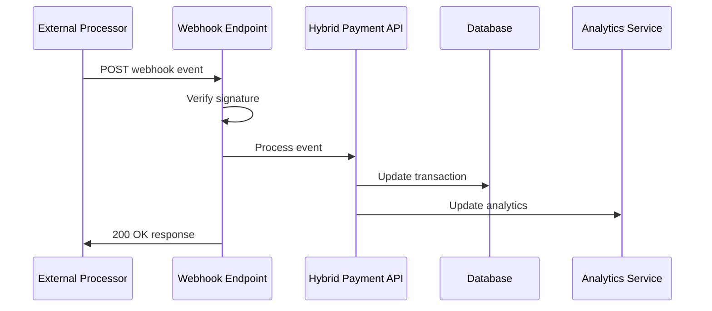

# 🔗 Webhook Integration Examples

## 🎯 Overview

This guide provides comprehensive examples for implementing webhook integrations with external payment processors in the Hybrid Payment System. Webhooks enable real-time synchronization of payment events from external processors like Square, Stripe, PayPal, and others.

## 🏗️ Webhook Architecture

### Webhook Flow



### Security Requirements

1. **Signature Verification**: All webhooks must verify signatures
2. **Idempotency**: Handle duplicate webhook deliveries
3. **Timestamp Validation**: Prevent replay attacks
4. **Rate Limiting**: Protect against webhook spam
5. **Error Handling**: Graceful failure and retry mechanisms

## 🟦 Square Webhook Integration

### Square Webhook Handler

```python
# square_webhook_handler.py
import hmac
import hashlib
import json
import logging
from datetime import datetime, timedelta
from typing import Dict, Any, Optional
from flask import Flask, request, jsonify
from sqlalchemy.orm import Session

from database import get_db
from models.hybrid_payment import PaymentProcessorConnection, ExternalTransaction
from services.external_payment_service import ExternalPaymentService

logger = logging.getLogger(__name__)

class SquareWebhookHandler:
    """Handle Square webhook notifications."""
    
    def __init__(self, db_session: Session):
        self.db = db_session
        self.external_service = ExternalPaymentService(db_session)
    
    def verify_signature(self, payload: str, signature: str, webhook_secret: str) -> bool:
        """
        Verify Square webhook signature.
        
        Square uses HMAC-SHA256 for webhook signature verification.
        """
        try:
            expected_signature = hmac.new(
                webhook_secret.encode('utf-8'),
                payload.encode('utf-8'),
                hashlib.sha256
            ).hexdigest()
            
            # Square signature format: "sha256=<signature>"
            if signature.startswith('sha256='):
                provided_signature = signature[7:]
            else:
                provided_signature = signature
            
            return hmac.compare_digest(expected_signature, provided_signature)
            
        except Exception as e:
            logger.error(f"Signature verification error: {e}")
            return False
    
    def validate_timestamp(self, timestamp: str, tolerance_minutes: int = 5) -> bool:
        """Validate webhook timestamp to prevent replay attacks."""
        try:
            webhook_time = datetime.fromisoformat(timestamp.replace('Z', '+00:00'))
            current_time = datetime.now().astimezone()
            time_diff = abs((current_time - webhook_time).total_seconds() / 60)
            
            return time_diff <= tolerance_minutes
        except Exception as e:
            logger.error(f"Timestamp validation error: {e}")
            return False
    
    def handle_payment_created(self, event_data: Dict[str, Any], connection: PaymentProcessorConnection) -> Dict[str, Any]:
        """Handle payment.created event."""
        payment_data = event_data.get('data', {}).get('object', {})
        
        # Extract payment information
        payment_id = payment_data.get('id')
        amount_money = payment_data.get('amount_money', {})
        amount = float(amount_money.get('amount', 0)) / 100  # Square uses cents
        currency = amount_money.get('currency', 'USD')
        status = self._map_square_status(payment_data.get('status'))
        
        # Get additional details
        location_id = payment_data.get('location_id')
        order_id = payment_data.get('order_id')
        receipt_number = payment_data.get('receipt_number')
        
        # Create or update external transaction
        existing_transaction = self.db.query(ExternalTransaction).filter(
            ExternalTransaction.external_transaction_id == payment_id,
            ExternalTransaction.processor_type == 'square'
        ).first()
        
        if existing_transaction:
            # Update existing transaction
            existing_transaction.amount = amount
            existing_transaction.currency = currency
            existing_transaction.status = status
            existing_transaction.external_metadata = {
                'location_id': location_id,
                'order_id': order_id,
                'receipt_number': receipt_number,
                'webhook_received_at': datetime.now().isoformat()
            }
            transaction = existing_transaction
        else:
            # Create new transaction
            transaction = ExternalTransaction(
                connection_id=connection.id,
                processor_type='square',
                external_transaction_id=payment_id,
                amount=amount,
                currency=currency,
                status=status,
                barber_id=connection.barber_id,
                external_metadata={
                    'location_id': location_id,
                    'order_id': order_id,
                    'receipt_number': receipt_number,
                    'webhook_received_at': datetime.now().isoformat()
                },
                processed_at=datetime.now() if status == 'completed' else None
            )
            self.db.add(transaction)
        
        self.db.commit()
        
        logger.info(f"Processed Square payment webhook: {payment_id} (${amount})")
        
        return {
            'transaction_id': transaction.id,
            'external_transaction_id': payment_id,
            'amount': amount,
            'status': status
        }
    
    def handle_payment_updated(self, event_data: Dict[str, Any], connection: PaymentProcessorConnection) -> Dict[str, Any]:
        """Handle payment.updated event."""
        # Similar to payment_created but focuses on status updates
        payment_data = event_data.get('data', {}).get('object', {})
        payment_id = payment_data.get('id')
        new_status = self._map_square_status(payment_data.get('status'))
        
        # Find existing transaction
        transaction = self.db.query(ExternalTransaction).filter(
            ExternalTransaction.external_transaction_id == payment_id,
            ExternalTransaction.processor_type == 'square'
        ).first()
        
        if transaction:
            transaction.status = new_status
            if new_status == 'completed' and not transaction.processed_at:
                transaction.processed_at = datetime.now()
            
            # Update metadata
            metadata = transaction.external_metadata or {}
            metadata['webhook_updated_at'] = datetime.now().isoformat()
            metadata['status_history'] = metadata.get('status_history', [])
            metadata['status_history'].append({
                'status': new_status,
                'timestamp': datetime.now().isoformat()
            })
            transaction.external_metadata = metadata
            
            self.db.commit()
            
            logger.info(f"Updated Square payment status: {payment_id} -> {new_status}")
            
            return {
                'transaction_id': transaction.id,
                'external_transaction_id': payment_id,
                'new_status': new_status
            }
        else:
            logger.warning(f"Transaction not found for Square payment update: {payment_id}")
            return {'error': 'Transaction not found'}
    
    def handle_refund_created(self, event_data: Dict[str, Any], connection: PaymentProcessorConnection) -> Dict[str, Any]:
        """Handle refund.created event."""
        refund_data = event_data.get('data', {}).get('object', {})
        
        refund_id = refund_data.get('id')
        payment_id = refund_data.get('payment_id')
        amount_money = refund_data.get('amount_money', {})
        refund_amount = float(amount_money.get('amount', 0)) / 100
        
        # Find original transaction
        original_transaction = self.db.query(ExternalTransaction).filter(
            ExternalTransaction.external_transaction_id == payment_id,
            ExternalTransaction.processor_type == 'square'
        ).first()
        
        if original_transaction:
            # Create refund transaction
            refund_transaction = ExternalTransaction(
                connection_id=connection.id,
                processor_type='square',
                external_transaction_id=refund_id,
                amount=-refund_amount,  # Negative amount for refund
                currency=original_transaction.currency,
                status='completed',
                barber_id=connection.barber_id,
                external_metadata={
                    'refund_for_payment': payment_id,
                    'refund_amount': refund_amount,
                    'webhook_received_at': datetime.now().isoformat()
                },
                processed_at=datetime.now()
            )
            
            self.db.add(refund_transaction)
            self.db.commit()
            
            logger.info(f"Processed Square refund webhook: {refund_id} (${refund_amount})")
            
            return {
                'refund_transaction_id': refund_transaction.id,
                'original_payment_id': payment_id,
                'refund_amount': refund_amount
            }
        else:
            logger.error(f"Original transaction not found for refund: {payment_id}")
            return {'error': 'Original transaction not found'}
    
    def _map_square_status(self, square_status: str) -> str:
        """Map Square payment status to our internal status."""
        status_mapping = {
            'APPROVED': 'completed',
            'PENDING': 'pending',
            'COMPLETED': 'completed',
            'CANCELED': 'failed',
            'FAILED': 'failed'
        }
        return status_mapping.get(square_status, 'pending')
    
    def process_webhook(self, connection_id: int, webhook_data: Dict[str, Any], 
                       signature: str) -> Dict[str, Any]:
        """Main webhook processing method."""
        # Get connection details
        connection = self.db.query(PaymentProcessorConnection).filter(
            PaymentProcessorConnection.id == connection_id,
            PaymentProcessorConnection.processor_type == 'square'
        ).first()
        
        if not connection:
            raise ValueError(f"Square connection {connection_id} not found")
        
        # Verify webhook signature
        webhook_secret = connection.webhook_secret
        if not webhook_secret:
            raise ValueError(f"No webhook secret configured for connection {connection_id}")
        
        payload_str = json.dumps(webhook_data, separators=(',', ':'))
        if not self.verify_signature(payload_str, signature, webhook_secret):
            raise ValueError("Invalid webhook signature")
        
        # Validate timestamp if present
        timestamp = webhook_data.get('created_at')
        if timestamp and not self.validate_timestamp(timestamp):
            logger.warning(f"Old webhook timestamp: {timestamp}")
        
        # Process event based on type
        event_type = webhook_data.get('type')
        
        if event_type == 'payment.created':
            return self.handle_payment_created(webhook_data, connection)
        elif event_type == 'payment.updated':
            return self.handle_payment_updated(webhook_data, connection)
        elif event_type == 'refund.created':
            return self.handle_refund_created(webhook_data, connection)
        else:
            logger.warning(f"Unhandled Square webhook event type: {event_type}")
            return {'message': f'Event type {event_type} not handled'}


# Flask application for webhook endpoints
app = Flask(__name__)

@app.route('/api/v1/webhooks/square/<int:connection_id>', methods=['POST'])
def square_webhook(connection_id: int):
    """Square webhook endpoint."""
    try:
        # Get webhook data
        webhook_data = request.get_json()
        signature = request.headers.get('X-Square-Signature', '')
        
        if not webhook_data:
            return jsonify({'error': 'No webhook data'}), 400
        
        if not signature:
            return jsonify({'error': 'Missing signature'}), 400
        
        # Process webhook
        db = next(get_db())
        handler = SquareWebhookHandler(db)
        
        result = handler.process_webhook(connection_id, webhook_data, signature)
        
        return jsonify({
            'received': True,
            'event_type': webhook_data.get('type'),
            'processed_at': datetime.now().isoformat(),
            'result': result
        })
        
    except ValueError as e:
        logger.error(f"Square webhook validation error: {e}")
        return jsonify({'error': str(e)}), 400
    except Exception as e:
        logger.error(f"Square webhook processing error: {e}")
        return jsonify({'error': 'Internal server error'}), 500
```

### Square Webhook Setup Script

```python
# setup_square_webhooks.py
import requests
import json
from typing import Dict, Any

class SquareWebhookSetup:
    """Set up Square webhooks for payment notifications."""
    
    def __init__(self, access_token: str, environment: str = 'sandbox'):
        self.access_token = access_token
        self.environment = environment
        self.base_url = 'https://connect.squareupsandbox.com' if environment == 'sandbox' else 'https://connect.squareup.com'
    
    def create_webhook_subscription(self, notification_url: str, connection_id: int) -> Dict[str, Any]:
        """Create a webhook subscription for payment events."""
        
        webhook_config = {
            "subscription": {
                "name": f"BookedBarber Payment Notifications - Connection {connection_id}",
                "event_types": [
                    "payment.created",
                    "payment.updated",
                    "refund.created",
                    "refund.updated"
                ],
                "notification_url": f"{notification_url}/api/v1/webhooks/square/{connection_id}",
                "api_version": "2023-10-18"
            }
        }
        
        headers = {
            'Authorization': f'Bearer {self.access_token}',
            'Content-Type': 'application/json',
            'Square-Version': '2023-10-18'
        }
        
        response = requests.post(
            f"{self.base_url}/v2/webhooks/subscriptions",
            headers=headers,
            json=webhook_config
        )
        
        if response.status_code == 200:
            return response.json()
        else:
            raise Exception(f"Failed to create webhook: {response.status_code} {response.text}")
    
    def list_webhook_subscriptions(self) -> Dict[str, Any]:
        """List all webhook subscriptions."""
        headers = {
            'Authorization': f'Bearer {self.access_token}',
            'Square-Version': '2023-10-18'
        }
        
        response = requests.get(
            f"{self.base_url}/v2/webhooks/subscriptions",
            headers=headers
        )
        
        if response.status_code == 200:
            return response.json()
        else:
            raise Exception(f"Failed to list webhooks: {response.status_code} {response.text}")
    
    def delete_webhook_subscription(self, subscription_id: str) -> bool:
        """Delete a webhook subscription."""
        headers = {
            'Authorization': f'Bearer {self.access_token}',
            'Square-Version': '2023-10-18'
        }
        
        response = requests.delete(
            f"{self.base_url}/v2/webhooks/subscriptions/{subscription_id}",
            headers=headers
        )
        
        return response.status_code == 200
    
    def test_webhook_subscription(self, subscription_id: str) -> Dict[str, Any]:
        """Test a webhook subscription."""
        headers = {
            'Authorization': f'Bearer {self.access_token}',
            'Content-Type': 'application/json',
            'Square-Version': '2023-10-18'
        }
        
        response = requests.post(
            f"{self.base_url}/v2/webhooks/subscriptions/{subscription_id}/test",
            headers=headers,
            json={"event_type": "payment.created"}
        )
        
        if response.status_code == 200:
            return response.json()
        else:
            raise Exception(f"Failed to test webhook: {response.status_code} {response.text}")

# Usage example
if __name__ == "__main__":
    setup = SquareWebhookSetup(
        access_token="YOUR_SQUARE_ACCESS_TOKEN",
        environment="sandbox"
    )
    
    # Create webhook subscription
    try:
        result = setup.create_webhook_subscription(
            notification_url="https://your-domain.com",
            connection_id=1
        )
        print(f"Webhook created: {result['subscription']['id']}")
        
        # Test the webhook
        test_result = setup.test_webhook_subscription(result['subscription']['id'])
        print(f"Webhook test: {test_result}")
        
    except Exception as e:
        print(f"Error: {e}")
```

## 🟣 Stripe Webhook Integration

### Stripe Webhook Handler

```python
# stripe_webhook_handler.py
import stripe
import json
import logging
from datetime import datetime
from typing import Dict, Any
from flask import Flask, request, jsonify
from sqlalchemy.orm import Session

from database import get_db
from models.hybrid_payment import PaymentProcessorConnection, ExternalTransaction
from services.external_payment_service import ExternalPaymentService

logger = logging.getLogger(__name__)

class StripeWebhookHandler:
    """Handle Stripe webhook notifications."""
    
    def __init__(self, db_session: Session):
        self.db = db_session
        self.external_service = ExternalPaymentService(db_session)
    
    def verify_signature(self, payload: str, signature: str, webhook_secret: str) -> stripe.Event:
        """
        Verify Stripe webhook signature and construct event.
        
        Stripe provides built-in signature verification.
        """
        try:
            event = stripe.Webhook.construct_event(
                payload, signature, webhook_secret
            )
            return event
        except ValueError as e:
            logger.error(f"Invalid payload: {e}")
            raise ValueError("Invalid payload")
        except stripe.error.SignatureVerificationError as e:
            logger.error(f"Invalid signature: {e}")
            raise ValueError("Invalid signature")
    
    def handle_payment_intent_succeeded(self, event_data: Dict[str, Any], connection: PaymentProcessorConnection) -> Dict[str, Any]:
        """Handle payment_intent.succeeded event."""
        payment_intent = event_data['data']['object']
        
        payment_id = payment_intent['id']
        amount = payment_intent['amount'] / 100  # Stripe uses cents
        currency = payment_intent['currency'].upper()
        status = 'completed'
        
        # Get additional details
        customer_id = payment_intent.get('customer')
        description = payment_intent.get('description')
        receipt_email = payment_intent.get('receipt_email')
        
        # Extract metadata
        metadata = payment_intent.get('metadata', {})
        
        # Create or update external transaction
        existing_transaction = self.db.query(ExternalTransaction).filter(
            ExternalTransaction.external_transaction_id == payment_id,
            ExternalTransaction.processor_type == 'stripe'
        ).first()
        
        if existing_transaction:
            # Update existing transaction
            existing_transaction.amount = amount
            existing_transaction.currency = currency
            existing_transaction.status = status
            existing_transaction.processed_at = datetime.now()
            existing_transaction.external_metadata = {
                'customer_id': customer_id,
                'description': description,
                'receipt_email': receipt_email,
                'stripe_metadata': metadata,
                'webhook_received_at': datetime.now().isoformat()
            }
            transaction = existing_transaction
        else:
            # Create new transaction
            transaction = ExternalTransaction(
                connection_id=connection.id,
                processor_type='stripe',
                external_transaction_id=payment_id,
                amount=amount,
                currency=currency,
                status=status,
                barber_id=connection.barber_id,
                external_customer_id=customer_id,
                external_metadata={
                    'customer_id': customer_id,
                    'description': description,
                    'receipt_email': receipt_email,
                    'stripe_metadata': metadata,
                    'webhook_received_at': datetime.now().isoformat()
                },
                processed_at=datetime.now()
            )
            self.db.add(transaction)
        
        self.db.commit()
        
        logger.info(f"Processed Stripe payment_intent.succeeded: {payment_id} (${amount})")
        
        return {
            'transaction_id': transaction.id,
            'external_transaction_id': payment_id,
            'amount': amount,
            'status': status
        }
    
    def handle_payment_intent_payment_failed(self, event_data: Dict[str, Any], connection: PaymentProcessorConnection) -> Dict[str, Any]:
        """Handle payment_intent.payment_failed event."""
        payment_intent = event_data['data']['object']
        
        payment_id = payment_intent['id']
        amount = payment_intent['amount'] / 100
        currency = payment_intent['currency'].upper()
        status = 'failed'
        
        # Get failure reason
        last_payment_error = payment_intent.get('last_payment_error', {})
        failure_code = last_payment_error.get('code')
        failure_message = last_payment_error.get('message')
        
        # Update or create transaction
        transaction = self.db.query(ExternalTransaction).filter(
            ExternalTransaction.external_transaction_id == payment_id,
            ExternalTransaction.processor_type == 'stripe'
        ).first()
        
        if transaction:
            transaction.status = status
            metadata = transaction.external_metadata or {}
            metadata.update({
                'failure_code': failure_code,
                'failure_message': failure_message,
                'failed_at': datetime.now().isoformat()
            })
            transaction.external_metadata = metadata
        else:
            # Create failed transaction record
            transaction = ExternalTransaction(
                connection_id=connection.id,
                processor_type='stripe',
                external_transaction_id=payment_id,
                amount=amount,
                currency=currency,
                status=status,
                barber_id=connection.barber_id,
                external_metadata={
                    'failure_code': failure_code,
                    'failure_message': failure_message,
                    'failed_at': datetime.now().isoformat()
                }
            )
            self.db.add(transaction)
        
        self.db.commit()
        
        logger.info(f"Processed Stripe payment failure: {payment_id} - {failure_code}")
        
        return {
            'transaction_id': transaction.id,
            'external_transaction_id': payment_id,
            'status': status,
            'failure_reason': failure_message
        }
    
    def handle_charge_dispute_created(self, event_data: Dict[str, Any], connection: PaymentProcessorConnection) -> Dict[str, Any]:
        """Handle charge.dispute.created event."""
        dispute = event_data['data']['object']
        
        charge_id = dispute['charge']
        dispute_id = dispute['id']
        amount = dispute['amount'] / 100
        reason = dispute['reason']
        status = dispute['status']
        
        # Find the original transaction
        original_transaction = self.db.query(ExternalTransaction).filter(
            ExternalTransaction.external_transaction_id == charge_id,
            ExternalTransaction.processor_type == 'stripe'
        ).first()
        
        if original_transaction:
            # Update transaction metadata with dispute information
            metadata = original_transaction.external_metadata or {}
            metadata['dispute'] = {
                'dispute_id': dispute_id,
                'amount': amount,
                'reason': reason,
                'status': status,
                'created_at': datetime.now().isoformat()
            }
            original_transaction.external_metadata = metadata
            
            # You might want to change transaction status to 'disputed'
            original_transaction.status = 'disputed'
            
            self.db.commit()
            
            logger.warning(f"Dispute created for Stripe charge {charge_id}: {reason}")
            
            return {
                'transaction_id': original_transaction.id,
                'dispute_id': dispute_id,
                'reason': reason,
                'amount': amount
            }
        else:
            logger.error(f"Original transaction not found for disputed charge: {charge_id}")
            return {'error': 'Original transaction not found'}
    
    def process_webhook(self, connection_id: int, payload: str, signature: str) -> Dict[str, Any]:
        """Main webhook processing method."""
        # Get connection details
        connection = self.db.query(PaymentProcessorConnection).filter(
            PaymentProcessorConnection.id == connection_id,
            PaymentProcessorConnection.processor_type == 'stripe'
        ).first()
        
        if not connection:
            raise ValueError(f"Stripe connection {connection_id} not found")
        
        # Get webhook secret
        webhook_secret = connection.webhook_secret
        if not webhook_secret:
            raise ValueError(f"No webhook secret configured for connection {connection_id}")
        
        # Verify signature and construct event
        event = self.verify_signature(payload, signature, webhook_secret)
        
        # Process event based on type
        event_type = event['type']
        
        if event_type == 'payment_intent.succeeded':
            return self.handle_payment_intent_succeeded(event, connection)
        elif event_type == 'payment_intent.payment_failed':
            return self.handle_payment_intent_payment_failed(event, connection)
        elif event_type == 'charge.dispute.created':
            return self.handle_charge_dispute_created(event, connection)
        else:
            logger.warning(f"Unhandled Stripe webhook event type: {event_type}")
            return {'message': f'Event type {event_type} not handled'}

# Flask endpoint for Stripe webhooks
@app.route('/api/v1/webhooks/stripe/<int:connection_id>', methods=['POST'])
def stripe_webhook(connection_id: int):
    """Stripe webhook endpoint."""
    try:
        # Get raw payload and signature
        payload = request.get_data(as_text=True)
        signature = request.headers.get('Stripe-Signature', '')
        
        if not payload:
            return jsonify({'error': 'No webhook data'}), 400
        
        if not signature:
            return jsonify({'error': 'Missing signature'}), 400
        
        # Process webhook
        db = next(get_db())
        handler = StripeWebhookHandler(db)
        
        result = handler.process_webhook(connection_id, payload, signature)
        
        return jsonify({
            'received': True,
            'processed_at': datetime.now().isoformat(),
            'result': result
        })
        
    except ValueError as e:
        logger.error(f"Stripe webhook validation error: {e}")
        return jsonify({'error': str(e)}), 400
    except Exception as e:
        logger.error(f"Stripe webhook processing error: {e}")
        return jsonify({'error': 'Internal server error'}), 500
```

## 🟡 PayPal Webhook Integration

### PayPal Webhook Handler

```python
# paypal_webhook_handler.py
import json
import logging
import requests
from datetime import datetime
from typing import Dict, Any
from flask import Flask, request, jsonify
from sqlalchemy.orm import Session

from database import get_db
from models.hybrid_payment import PaymentProcessorConnection, ExternalTransaction

logger = logging.getLogger(__name__)

class PayPalWebhookHandler:
    """Handle PayPal webhook notifications."""
    
    def __init__(self, db_session: Session):
        self.db = db_session
    
    def verify_webhook_signature(self, webhook_data: Dict[str, Any], 
                                webhook_id: str, client_id: str, client_secret: str) -> bool:
        """
        Verify PayPal webhook signature.
        
        PayPal provides a verification API endpoint.
        """
        try:
            # Get access token
            auth_response = requests.post(
                'https://api.sandbox.paypal.com/v1/oauth2/token',  # Use production URL for live
                headers={
                    'Accept': 'application/json',
                    'Accept-Language': 'en_US',
                },
                auth=(client_id, client_secret),
                data={'grant_type': 'client_credentials'}
            )
            
            if auth_response.status_code != 200:
                logger.error(f"Failed to get PayPal access token: {auth_response.text}")
                return False
            
            access_token = auth_response.json()['access_token']
            
            # Verify webhook
            verification_data = {
                'auth_algo': request.headers.get('PAYPAL-AUTH-ALGO'),
                'cert_id': request.headers.get('PAYPAL-CERT-ID'),
                'transmission_id': request.headers.get('PAYPAL-TRANSMISSION-ID'),
                'transmission_sig': request.headers.get('PAYPAL-TRANSMISSION-SIG'),
                'transmission_time': request.headers.get('PAYPAL-TRANSMISSION-TIME'),
                'webhook_id': webhook_id,
                'webhook_event': webhook_data
            }
            
            verify_response = requests.post(
                'https://api.sandbox.paypal.com/v1/notifications/verify-webhook-signature',
                headers={
                    'Content-Type': 'application/json',
                    'Authorization': f'Bearer {access_token}'
                },
                json=verification_data
            )
            
            if verify_response.status_code == 200:
                verification_result = verify_response.json()
                return verification_result.get('verification_status') == 'SUCCESS'
            else:
                logger.error(f"PayPal signature verification failed: {verify_response.text}")
                return False
                
        except Exception as e:
            logger.error(f"PayPal signature verification error: {e}")
            return False
    
    def handle_payment_sale_completed(self, event_data: Dict[str, Any], connection: PaymentProcessorConnection) -> Dict[str, Any]:
        """Handle PAYMENT.SALE.COMPLETED event."""
        sale_data = event_data.get('resource', {})
        
        sale_id = sale_data.get('id')
        amount = float(sale_data.get('amount', {}).get('total', '0'))
        currency = sale_data.get('amount', {}).get('currency', 'USD')
        state = sale_data.get('state', 'pending')
        
        # Map PayPal state to our status
        status_mapping = {
            'completed': 'completed',
            'pending': 'pending',
            'refunded': 'refunded',
            'partially_refunded': 'completed'
        }
        status = status_mapping.get(state, 'pending')
        
        # Get transaction details
        parent_payment = sale_data.get('parent_payment')
        create_time = sale_data.get('create_time')
        update_time = sale_data.get('update_time')
        
        # Create or update transaction
        existing_transaction = self.db.query(ExternalTransaction).filter(
            ExternalTransaction.external_transaction_id == sale_id,
            ExternalTransaction.processor_type == 'paypal'
        ).first()
        
        if existing_transaction:
            existing_transaction.amount = amount
            existing_transaction.currency = currency
            existing_transaction.status = status
            existing_transaction.processed_at = datetime.fromisoformat(update_time.replace('Z', '+00:00')) if update_time else datetime.now()
            transaction = existing_transaction
        else:
            transaction = ExternalTransaction(
                connection_id=connection.id,
                processor_type='paypal',
                external_transaction_id=sale_id,
                amount=amount,
                currency=currency,
                status=status,
                barber_id=connection.barber_id,
                external_metadata={
                    'parent_payment': parent_payment,
                    'paypal_state': state,
                    'create_time': create_time,
                    'update_time': update_time,
                    'webhook_received_at': datetime.now().isoformat()
                },
                processed_at=datetime.fromisoformat(create_time.replace('Z', '+00:00')) if create_time else datetime.now()
            )
            self.db.add(transaction)
        
        self.db.commit()
        
        logger.info(f"Processed PayPal sale completed: {sale_id} (${amount})")
        
        return {
            'transaction_id': transaction.id,
            'external_transaction_id': sale_id,
            'amount': amount,
            'status': status
        }
    
    def handle_payment_sale_refunded(self, event_data: Dict[str, Any], connection: PaymentProcessorConnection) -> Dict[str, Any]:
        """Handle PAYMENT.SALE.REFUNDED event."""
        refund_data = event_data.get('resource', {})
        
        refund_id = refund_data.get('id')
        sale_id = refund_data.get('sale_id')
        refund_amount = float(refund_data.get('amount', {}).get('total', '0'))
        currency = refund_data.get('amount', {}).get('currency', 'USD')
        
        # Find original transaction
        original_transaction = self.db.query(ExternalTransaction).filter(
            ExternalTransaction.external_transaction_id == sale_id,
            ExternalTransaction.processor_type == 'paypal'
        ).first()
        
        if original_transaction:
            # Create refund transaction
            refund_transaction = ExternalTransaction(
                connection_id=connection.id,
                processor_type='paypal',
                external_transaction_id=refund_id,
                amount=-refund_amount,  # Negative amount for refund
                currency=currency,
                status='completed',
                barber_id=connection.barber_id,
                external_metadata={
                    'refund_for_sale': sale_id,
                    'refund_amount': refund_amount,
                    'webhook_received_at': datetime.now().isoformat()
                },
                processed_at=datetime.now()
            )
            
            self.db.add(refund_transaction)
            self.db.commit()
            
            logger.info(f"Processed PayPal refund: {refund_id} (${refund_amount})")
            
            return {
                'refund_transaction_id': refund_transaction.id,
                'original_sale_id': sale_id,
                'refund_amount': refund_amount
            }
        else:
            logger.error(f"Original transaction not found for PayPal refund: {sale_id}")
            return {'error': 'Original transaction not found'}
    
    def process_webhook(self, connection_id: int, webhook_data: Dict[str, Any]) -> Dict[str, Any]:
        """Main webhook processing method."""
        # Get connection details
        connection = self.db.query(PaymentProcessorConnection).filter(
            PaymentProcessorConnection.id == connection_id,
            PaymentProcessorConnection.processor_type == 'paypal'
        ).first()
        
        if not connection:
            raise ValueError(f"PayPal connection {connection_id} not found")
        
        # Get PayPal credentials from connection data
        connection_data = connection.connection_data or {}
        client_id = connection_data.get('client_id')
        client_secret = connection_data.get('client_secret')
        webhook_id = connection_data.get('webhook_id')
        
        if not all([client_id, client_secret, webhook_id]):
            raise ValueError("Missing PayPal credentials for webhook verification")
        
        # Verify webhook signature
        if not self.verify_webhook_signature(webhook_data, webhook_id, client_id, client_secret):
            raise ValueError("Invalid PayPal webhook signature")
        
        # Process event based on type
        event_type = webhook_data.get('event_type')
        
        if event_type == 'PAYMENT.SALE.COMPLETED':
            return self.handle_payment_sale_completed(webhook_data, connection)
        elif event_type == 'PAYMENT.SALE.REFUNDED':
            return self.handle_payment_sale_refunded(webhook_data, connection)
        else:
            logger.warning(f"Unhandled PayPal webhook event type: {event_type}")
            return {'message': f'Event type {event_type} not handled'}

# Flask endpoint for PayPal webhooks
@app.route('/api/v1/webhooks/paypal/<int:connection_id>', methods=['POST'])
def paypal_webhook(connection_id: int):
    """PayPal webhook endpoint."""
    try:
        # Get webhook data
        webhook_data = request.get_json()
        
        if not webhook_data:
            return jsonify({'error': 'No webhook data'}), 400
        
        # Process webhook
        db = next(get_db())
        handler = PayPalWebhookHandler(db)
        
        result = handler.process_webhook(connection_id, webhook_data)
        
        return jsonify({
            'received': True,
            'event_type': webhook_data.get('event_type'),
            'processed_at': datetime.now().isoformat(),
            'result': result
        })
        
    except ValueError as e:
        logger.error(f"PayPal webhook validation error: {e}")
        return jsonify({'error': str(e)}), 400
    except Exception as e:
        logger.error(f"PayPal webhook processing error: {e}")
        return jsonify({'error': 'Internal server error'}), 500
```

## 🔧 Generic Webhook Infrastructure

### Webhook Manager

```python
# webhook_manager.py
import json
import logging
from typing import Dict, Any, Optional
from datetime import datetime, timedelta
from sqlalchemy.orm import Session
from sqlalchemy import and_

from database import get_db
from models.hybrid_payment import PaymentProcessorConnection, ExternalTransaction

logger = logging.getLogger(__name__)

class WebhookEvent:
    """Represents a webhook event."""
    
    def __init__(self, connection_id: int, processor: str, event_type: str, 
                 event_data: Dict[str, Any], signature: str, 
                 timestamp: Optional[datetime] = None):
        self.connection_id = connection_id
        self.processor = processor
        self.event_type = event_type
        self.event_data = event_data
        self.signature = signature
        self.timestamp = timestamp or datetime.now()
        self.processed = False
        self.result = None
        self.error = None

class WebhookDeduplicator:
    """Handles webhook deduplication to prevent processing duplicate events."""
    
    def __init__(self, db_session: Session):
        self.db = db_session
        self._processed_events = {}  # In-memory cache for recent events
    
    def is_duplicate(self, webhook_event: WebhookEvent) -> bool:
        """Check if this webhook event has already been processed."""
        
        # Generate event key for deduplication
        event_key = self._generate_event_key(webhook_event)
        
        # Check in-memory cache first
        if event_key in self._processed_events:
            last_processed = self._processed_events[event_key]
            if (webhook_event.timestamp - last_processed).total_seconds() < 300:  # 5 minutes
                return True
        
        # Check database for recent similar events
        # This is processor-specific logic
        if webhook_event.processor == 'stripe':
            return self._check_stripe_duplicate(webhook_event)
        elif webhook_event.processor == 'square':
            return self._check_square_duplicate(webhook_event)
        elif webhook_event.processor == 'paypal':
            return self._check_paypal_duplicate(webhook_event)
        
        return False
    
    def mark_processed(self, webhook_event: WebhookEvent):
        """Mark an event as processed."""
        event_key = self._generate_event_key(webhook_event)
        self._processed_events[event_key] = webhook_event.timestamp
        
        # Clean up old entries
        cutoff_time = webhook_event.timestamp - timedelta(minutes=30)
        self._processed_events = {
            k: v for k, v in self._processed_events.items() 
            if v > cutoff_time
        }
    
    def _generate_event_key(self, webhook_event: WebhookEvent) -> str:
        """Generate a unique key for the event."""
        return f"{webhook_event.processor}:{webhook_event.connection_id}:{webhook_event.event_type}:{hash(json.dumps(webhook_event.event_data, sort_keys=True))}"
    
    def _check_stripe_duplicate(self, webhook_event: WebhookEvent) -> bool:
        """Check for Stripe event duplicates using event ID."""
        event_id = webhook_event.event_data.get('id')
        if not event_id:
            return False
        
        # Check if we've processed this Stripe event ID recently
        recent_time = webhook_event.timestamp - timedelta(hours=1)
        
        existing_transaction = self.db.query(ExternalTransaction).filter(
            and_(
                ExternalTransaction.processor_type == 'stripe',
                ExternalTransaction.connection_id == webhook_event.connection_id,
                ExternalTransaction.created_at > recent_time,
                ExternalTransaction.external_metadata.contains({'stripe_event_id': event_id})
            )
        ).first()
        
        return existing_transaction is not None
    
    def _check_square_duplicate(self, webhook_event: WebhookEvent) -> bool:
        """Check for Square event duplicates using payment ID and timestamp."""
        payment_data = webhook_event.event_data.get('data', {}).get('object', {})
        payment_id = payment_data.get('id')
        
        if not payment_id:
            return False
        
        # Check for recent transactions with same payment ID
        recent_time = webhook_event.timestamp - timedelta(minutes=10)
        
        existing_transaction = self.db.query(ExternalTransaction).filter(
            and_(
                ExternalTransaction.processor_type == 'square',
                ExternalTransaction.external_transaction_id == payment_id,
                ExternalTransaction.updated_at > recent_time
            )
        ).first()
        
        return existing_transaction is not None
    
    def _check_paypal_duplicate(self, webhook_event: WebhookEvent) -> bool:
        """Check for PayPal event duplicates using resource ID."""
        resource_data = webhook_event.event_data.get('resource', {})
        resource_id = resource_data.get('id')
        
        if not resource_id:
            return False
        
        # Check for recent transactions with same resource ID
        recent_time = webhook_event.timestamp - timedelta(minutes=10)
        
        existing_transaction = self.db.query(ExternalTransaction).filter(
            and_(
                ExternalTransaction.processor_type == 'paypal',
                ExternalTransaction.external_transaction_id == resource_id,
                ExternalTransaction.updated_at > recent_time
            )
        ).first()
        
        return existing_transaction is not None

class WebhookProcessor:
    """Main webhook processing coordinator."""
    
    def __init__(self):
        self.handlers = {}
        self.deduplicator = None
    
    def register_handler(self, processor: str, handler_class):
        """Register a webhook handler for a processor."""
        self.handlers[processor] = handler_class
    
    def process_webhook(self, webhook_event: WebhookEvent) -> Dict[str, Any]:
        """Process a webhook event."""
        db = next(get_db())
        
        try:
            # Initialize deduplicator
            if not self.deduplicator:
                self.deduplicator = WebhookDeduplicator(db)
            
            # Check for duplicates
            if self.deduplicator.is_duplicate(webhook_event):
                logger.info(f"Duplicate webhook event ignored: {webhook_event.processor} {webhook_event.event_type}")
                return {
                    'status': 'duplicate',
                    'message': 'Event already processed'
                }
            
            # Get appropriate handler
            handler_class = self.handlers.get(webhook_event.processor)
            if not handler_class:
                raise ValueError(f"No handler registered for processor: {webhook_event.processor}")
            
            # Process the webhook
            handler = handler_class(db)
            
            if webhook_event.processor == 'stripe':
                # Stripe handler expects payload string and signature
                payload = json.dumps(webhook_event.event_data)
                result = handler.process_webhook(webhook_event.connection_id, payload, webhook_event.signature)
            else:
                # Other handlers expect event data and signature
                result = handler.process_webhook(webhook_event.connection_id, webhook_event.event_data, webhook_event.signature)
            
            # Mark as processed
            self.deduplicator.mark_processed(webhook_event)
            webhook_event.processed = True
            webhook_event.result = result
            
            logger.info(f"Webhook processed successfully: {webhook_event.processor} {webhook_event.event_type}")
            
            return {
                'status': 'success',
                'result': result
            }
            
        except Exception as e:
            webhook_event.error = str(e)
            logger.error(f"Webhook processing failed: {webhook_event.processor} {webhook_event.event_type} - {e}")
            
            return {
                'status': 'error',
                'error': str(e)
            }

# Global webhook processor instance
webhook_processor = WebhookProcessor()

# Register handlers
from square_webhook_handler import SquareWebhookHandler
from stripe_webhook_handler import StripeWebhookHandler
from paypal_webhook_handler import PayPalWebhookHandler

webhook_processor.register_handler('square', SquareWebhookHandler)
webhook_processor.register_handler('stripe', StripeWebhookHandler)
webhook_processor.register_handler('paypal', PayPalWebhookHandler)
```

### Universal Webhook Endpoint

```python
# universal_webhook_endpoint.py
from flask import Flask, request, jsonify
from datetime import datetime
from webhook_manager import webhook_processor, WebhookEvent

app = Flask(__name__)

@app.route('/api/v1/webhooks/<processor>/<int:connection_id>', methods=['POST'])
def universal_webhook(processor: str, connection_id: int):
    """Universal webhook endpoint for all processors."""
    
    try:
        # Validate processor
        if processor not in ['stripe', 'square', 'paypal', 'clover']:
            return jsonify({'error': f'Unsupported processor: {processor}'}), 400
        
        # Get webhook data
        if processor == 'stripe':
            # Stripe requires raw payload for signature verification
            payload = request.get_data(as_text=True)
            event_data = request.get_json()
            signature = request.headers.get('Stripe-Signature', '')
        else:
            # Other processors can use JSON directly
            event_data = request.get_json()
            payload = request.get_data(as_text=True)
            
            if processor == 'square':
                signature = request.headers.get('X-Square-Signature', '')
            elif processor == 'paypal':
                signature = request.headers.get('PAYPAL-TRANSMISSION-SIG', '')
            else:
                signature = ''
        
        if not event_data:
            return jsonify({'error': 'No webhook data provided'}), 400
        
        # Extract event type
        if processor == 'stripe':
            event_type = event_data.get('type', 'unknown')
        elif processor == 'square':
            event_type = event_data.get('type', 'unknown')
        elif processor == 'paypal':
            event_type = event_data.get('event_type', 'unknown')
        else:
            event_type = 'unknown'
        
        # Create webhook event
        webhook_event = WebhookEvent(
            connection_id=connection_id,
            processor=processor,
            event_type=event_type,
            event_data=event_data,
            signature=signature,
            timestamp=datetime.now()
        )
        
        # Process webhook
        result = webhook_processor.process_webhook(webhook_event)
        
        # Return response
        return jsonify({
            'received': True,
            'processor': processor,
            'connection_id': connection_id,
            'event_type': event_type,
            'processed_at': datetime.now().isoformat(),
            'processing_result': result
        })
        
    except Exception as e:
        logger.error(f"Universal webhook error: {e}")
        return jsonify({
            'error': 'Webhook processing failed',
            'details': str(e)
        }), 500

@app.route('/api/v1/webhooks/test', methods=['POST'])
def test_webhook():
    """Test endpoint for webhook validation."""
    data = request.get_json()
    
    return jsonify({
        'received': True,
        'test_mode': True,
        'data': data,
        'headers': dict(request.headers),
        'timestamp': datetime.now().isoformat()
    })

if __name__ == '__main__':
    app.run(debug=True, port=5000)
```

## 📊 Webhook Monitoring & Analytics

### Webhook Analytics Dashboard

```python
# webhook_analytics.py
from datetime import datetime, timedelta
from sqlalchemy import func, and_
from sqlalchemy.orm import Session
from collections import defaultdict

class WebhookAnalytics:
    """Analytics for webhook processing."""
    
    def __init__(self, db_session: Session):
        self.db = db_session
    
    def get_webhook_stats(self, days: int = 7) -> Dict[str, Any]:
        """Get webhook processing statistics."""
        cutoff_date = datetime.now() - timedelta(days=days)
        
        # Get transactions created via webhooks
        webhook_transactions = self.db.query(ExternalTransaction).filter(
            and_(
                ExternalTransaction.created_at > cutoff_date,
                ExternalTransaction.external_metadata.isnot(None)
            )
        ).all()
        
        stats = {
            'total_webhook_transactions': len(webhook_transactions),
            'by_processor': defaultdict(int),
            'by_status': defaultdict(int),
            'daily_volume': defaultdict(lambda: {'count': 0, 'amount': 0}),
            'average_processing_time': 0,
            'success_rate': 0
        }
        
        total_amount = 0
        success_count = 0
        
        for transaction in webhook_transactions:
            processor = transaction.processor_type
            status = transaction.status
            amount = float(transaction.amount)
            day = transaction.created_at.strftime('%Y-%m-%d')
            
            stats['by_processor'][processor] += 1
            stats['by_status'][status] += 1
            stats['daily_volume'][day]['count'] += 1
            stats['daily_volume'][day]['amount'] += amount
            
            total_amount += amount
            if status == 'completed':
                success_count += 1
        
        if webhook_transactions:
            stats['success_rate'] = (success_count / len(webhook_transactions)) * 100
            stats['total_amount'] = total_amount
            stats['average_amount'] = total_amount / len(webhook_transactions)
        
        return stats
    
    def get_webhook_errors(self, days: int = 1) -> List[Dict[str, Any]]:
        """Get recent webhook processing errors."""
        # This would require a webhook_logs table to track errors
        # For now, we'll return failed transactions that might indicate webhook issues
        
        cutoff_date = datetime.now() - timedelta(days=days)
        
        failed_transactions = self.db.query(ExternalTransaction).filter(
            and_(
                ExternalTransaction.created_at > cutoff_date,
                ExternalTransaction.status == 'failed'
            )
        ).all()
        
        errors = []
        for transaction in failed_transactions:
            metadata = transaction.external_metadata or {}
            errors.append({
                'transaction_id': transaction.id,
                'processor': transaction.processor_type,
                'external_id': transaction.external_transaction_id,
                'amount': float(transaction.amount),
                'error_message': metadata.get('failure_message', 'Unknown error'),
                'timestamp': transaction.created_at.isoformat()
            })
        
        return errors
```

---

This comprehensive webhook integration guide provides examples for implementing secure, reliable webhook processing for Square, Stripe, PayPal, and other payment processors. The examples include signature verification, deduplication, error handling, and monitoring to ensure robust webhook integration in production environments.