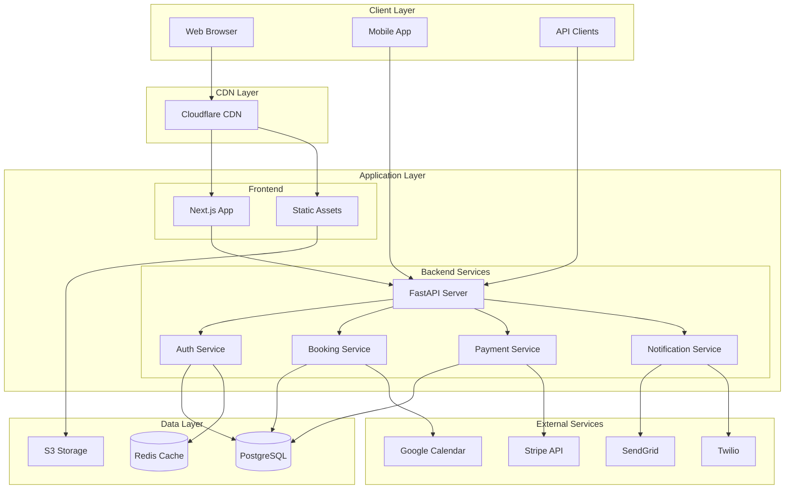
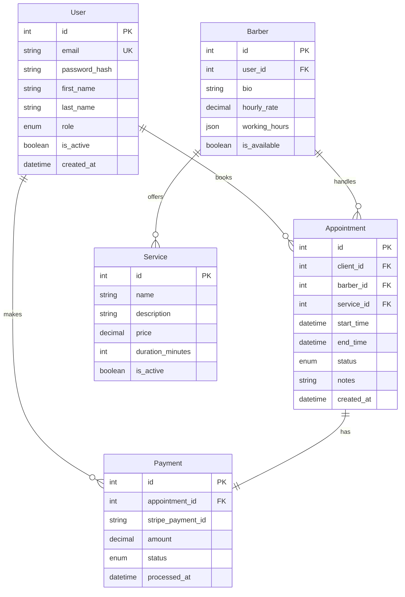
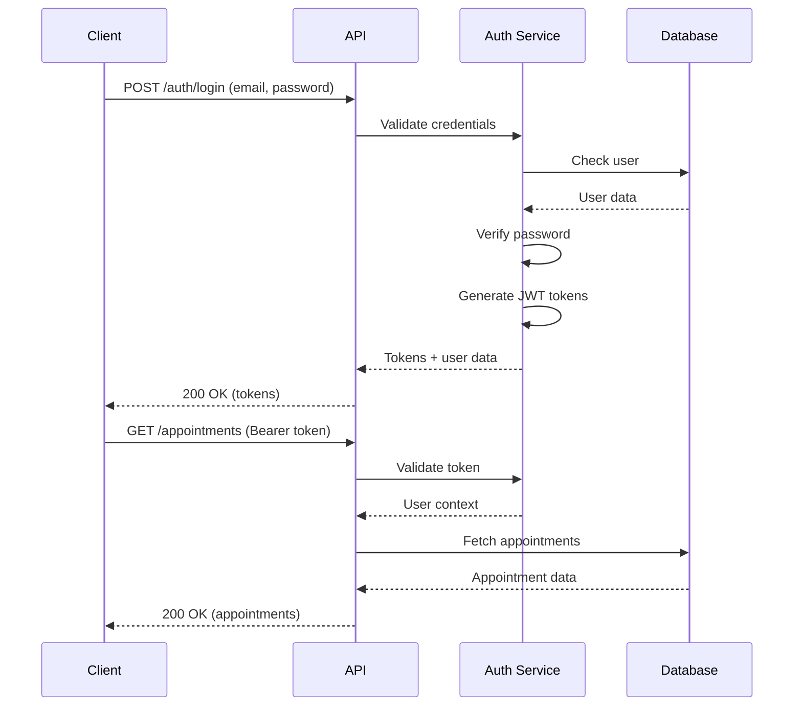

# BookedBarber V2 Architecture

This document provides a comprehensive overview of the BookedBarber V2 platform architecture, design patterns, and technical decisions.

## Table of Contents
- [System Overview](#system-overview)
- [Architecture Principles](#architecture-principles)
- [High-Level Architecture](#high-level-architecture)
- [Backend Architecture](#backend-architecture)
- [Frontend Architecture](#frontend-architecture)
- [Database Design](#database-design)
- [API Design](#api-design)
- [Security Architecture](#security-architecture)
- [Integration Architecture](#integration-architecture)
- [Deployment Architecture](#deployment-architecture)
- [Performance Considerations](#performance-considerations)
- [Monitoring & Observability](#monitoring--observability)

## System Overview

BookedBarber V2 is a modern, scalable SaaS platform built with a microservices-oriented architecture using:

- **Backend**: FastAPI (Python) for high-performance async APIs
- **Frontend**: Next.js 14 (TypeScript) for server-side rendering and optimal performance
- **Database**: PostgreSQL for reliability and complex queries
- **Cache**: Redis for session management and performance optimization
- **Queue**: Celery with Redis for background tasks

### Architecture Diagram



## Architecture Principles

### 1. **Separation of Concerns**
- Clear boundaries between presentation, business logic, and data layers
- Each service has a single, well-defined responsibility

### 2. **Scalability First**
- Horizontal scaling capabilities built-in
- Stateless services for easy scaling
- Database connection pooling and query optimization

### 3. **Security by Design**
- Authentication and authorization at every layer
- Data encryption in transit and at rest
- Regular security audits and dependency updates

### 4. **Developer Experience**
- Comprehensive documentation and type safety
- Automated testing and deployment pipelines
- Consistent coding standards and patterns

### 5. **Performance Optimization**
- Caching strategies at multiple levels
- Lazy loading and code splitting
- Database query optimization

## High-Level Architecture

### Component Overview

```
┌─────────────────────────────────────────────────────────────┐
│                        Load Balancer                         │
├─────────────────────┬───────────────────────────────────────┤
│                     │                                       │
│   Frontend (SSR)    │          Backend API                 │
│   ┌─────────────┐   │   ┌─────────────────────────────┐   │
│   │  Next.js 14 │   │   │      FastAPI Server        │   │
│   │  + React    │   │   │  ┌─────────────────────┐   │   │
│   │  + TypeScript│   │   │  │   REST API Layer   │   │   │
│   └─────────────┘   │   │  └─────────────────────┘   │   │
│                     │   │  ┌─────────────────────┐   │   │
│                     │   │  │  Business Logic    │   │   │
│                     │   │  │     Services       │   │   │
│                     │   │  └─────────────────────┘   │   │
│                     │   │  ┌─────────────────────┐   │   │
│                     │   │  │   Data Access      │   │   │
│                     │   │  │     Layer          │   │   │
│                     │   │  └─────────────────────┘   │   │
│                     │   └─────────────────────────────┘   │
├─────────────────────┴───────────────────────────────────────┤
│                        Data Layer                            │
│  ┌──────────────┐  ┌──────────────┐  ┌──────────────┐     │
│  │  PostgreSQL  │  │    Redis     │  │  S3 Storage  │     │
│  └──────────────┘  └──────────────┘  └──────────────┘     │
└─────────────────────────────────────────────────────────────┘
```

## Backend Architecture

### Directory Structure

```
backend-v2/
├── api/
│   └── v1/
│       ├── endpoints/      # API route handlers
│       ├── dependencies/   # Dependency injection
│       └── middleware/     # Request/response middleware
├── core/
│   ├── config.py          # Configuration management
│   ├── security.py        # Security utilities
│   └── exceptions.py      # Custom exceptions
├── models/                # SQLAlchemy ORM models
│   ├── user.py
│   ├── appointment.py
│   ├── payment.py
│   └── base.py
├── schemas/               # Pydantic schemas
│   ├── user.py
│   ├── appointment.py
│   └── payment.py
├── services/              # Business logic
│   ├── auth_service.py
│   ├── booking_service.py
│   ├── payment_service.py
│   └── notification_service.py
├── db/                    # Database utilities
│   ├── session.py
│   └── migrations/
├── tests/                 # Test suite
└── main.py               # Application entry point
```

### Key Design Patterns

#### 1. **Repository Pattern**
```python
class UserRepository:
    def __init__(self, db: Session):
        self.db = db
    
    async def get_by_email(self, email: str) -> Optional[User]:
        return self.db.query(User).filter(User.email == email).first()
    
    async def create(self, user_data: UserCreate) -> User:
        user = User(**user_data.dict())
        self.db.add(user)
        self.db.commit()
        return user
```

#### 2. **Service Layer Pattern**
```python
class BookingService:
    def __init__(self, repo: BookingRepository):
        self.repo = repo
    
    async def create_appointment(
        self, 
        user_id: int, 
        appointment_data: AppointmentCreate
    ) -> Appointment:
        # Business logic validation
        await self._validate_time_slot(appointment_data)
        await self._check_availability(appointment_data)
        
        # Create appointment
        appointment = await self.repo.create(user_id, appointment_data)
        
        # Send notifications
        await self._send_confirmation_email(appointment)
        
        return appointment
```

#### 3. **Dependency Injection**
```python
async def get_current_user(
    token: str = Depends(oauth2_scheme),
    db: Session = Depends(get_db)
) -> User:
    credentials_exception = HTTPException(
        status_code=401,
        detail="Could not validate credentials"
    )
    
    payload = verify_token(token)
    user = db.query(User).filter(User.id == payload.get("sub")).first()
    
    if user is None:
        raise credentials_exception
    
    return user
```

## Frontend Architecture

### Directory Structure

```
frontend-v2/
├── app/                   # Next.js 14 App Router
│   ├── (auth)/           # Authenticated routes
│   ├── (public)/         # Public routes
│   ├── api/              # API routes (BFF pattern)
│   └── layout.tsx        # Root layout
├── components/
│   ├── ui/               # Base UI components
│   ├── features/         # Feature-specific components
│   └── layouts/          # Layout components
├── lib/
│   ├── api/              # API client functions
│   ├── hooks/            # Custom React hooks
│   ├── utils/            # Utility functions
│   └── validators/       # Zod schemas
├── styles/               # Global styles
├── types/                # TypeScript types
└── public/               # Static assets
```

### State Management

```typescript
// Using React Query for server state
const useAppointments = () => {
  return useQuery({
    queryKey: ['appointments'],
    queryFn: fetchAppointments,
    staleTime: 5 * 60 * 1000, // 5 minutes
  });
};

// Using Context for auth state
const AuthContext = createContext<AuthContextType | null>(null);

export const AuthProvider = ({ children }) => {
  const [user, setUser] = useState<User | null>(null);
  
  return (
    <AuthContext.Provider value={{ user, setUser }}>
      {children}
    </AuthContext.Provider>
  );
};
```

### Component Architecture

```typescript
// Feature component example
interface BookingCalendarProps {
  barberId: string;
  onDateSelect: (date: Date) => void;
}

export const BookingCalendar: FC<BookingCalendarProps> = ({
  barberId,
  onDateSelect
}) => {
  const { data: availability } = useAvailability(barberId);
  
  return (
    <Calendar
      availableDates={availability?.dates}
      onSelect={onDateSelect}
    />
  );
};
```

## Database Design

### Entity Relationship Diagram



### Key Indexes

```sql
-- Performance indexes
CREATE INDEX idx_appointments_barber_date ON appointments(barber_id, start_time);
CREATE INDEX idx_appointments_client ON appointments(client_id);
CREATE INDEX idx_payments_status ON payments(status);

-- Full-text search
CREATE INDEX idx_users_search ON users USING gin(
    to_tsvector('english', first_name || ' ' || last_name || ' ' || email)
);
```

## API Design

### RESTful Endpoints

```yaml
openapi: 3.0.0
paths:
  /api/v1/auth/login:
    post:
      summary: User login
      requestBody:
        content:
          application/json:
            schema:
              type: object
              properties:
                email:
                  type: string
                password:
                  type: string
      responses:
        200:
          description: Login successful
          content:
            application/json:
              schema:
                type: object
                properties:
                  access_token:
                    type: string
                  refresh_token:
                    type: string
                  user:
                    $ref: '#/components/schemas/User'
  
  /api/v1/appointments:
    get:
      summary: List appointments
      security:
        - bearerAuth: []
      parameters:
        - name: date
          in: query
          schema:
            type: string
            format: date
        - name: barber_id
          in: query
          schema:
            type: integer
      responses:
        200:
          description: List of appointments
          content:
            application/json:
              schema:
                type: array
                items:
                  $ref: '#/components/schemas/Appointment'
```

### API Versioning Strategy

- URL-based versioning: `/api/v1/`, `/api/v2/`
- Backward compatibility for at least 6 months
- Deprecation notices in headers: `X-API-Deprecation-Date`

## Security Architecture

### Authentication Flow



### Security Measures

1. **Authentication**: JWT with refresh tokens
2. **Authorization**: Role-based access control (RBAC)
3. **Data Protection**: 
   - Bcrypt for password hashing
   - AES-256 for sensitive data encryption
   - TLS 1.3 for data in transit
4. **API Security**:
   - Rate limiting (100 requests/minute)
   - CORS configuration
   - Input validation and sanitization
5. **Infrastructure Security**:
   - WAF (Web Application Firewall)
   - DDoS protection
   - Regular security audits

## Integration Architecture

### Payment Processing (Stripe)

```python
class StripePaymentService:
    async def create_payment_intent(
        self, 
        amount: Decimal, 
        appointment_id: int
    ) -> PaymentIntent:
        intent = stripe.PaymentIntent.create(
            amount=int(amount * 100),  # Convert to cents
            currency='usd',
            metadata={
                'appointment_id': appointment_id
            }
        )
        return intent
    
    async def handle_webhook(self, event: dict) -> None:
        if event['type'] == 'payment_intent.succeeded':
            await self._handle_payment_success(event['data']['object'])
```

### Calendar Sync (Google Calendar)

```python
class GoogleCalendarService:
    async def sync_appointment(self, appointment: Appointment) -> str:
        event = {
            'summary': f'Appointment with {appointment.client.name}',
            'start': {
                'dateTime': appointment.start_time.isoformat(),
                'timeZone': 'America/New_York',
            },
            'end': {
                'dateTime': appointment.end_time.isoformat(),
                'timeZone': 'America/New_York',
            }
        }
        
        result = self.service.events().insert(
            calendarId='primary',
            body=event
        ).execute()
        
        return result['id']
```

## Deployment Architecture

### Container Architecture

```dockerfile
# Backend Dockerfile
FROM python:3.9-slim

WORKDIR /app

COPY requirements.txt .
RUN pip install --no-cache-dir -r requirements.txt

COPY . .

CMD ["uvicorn", "main:app", "--host", "0.0.0.0", "--port", "8000"]
```

### Kubernetes Deployment

```yaml
apiVersion: apps/v1
kind: Deployment
metadata:
  name: bookedbarber-api
spec:
  replicas: 3
  selector:
    matchLabels:
      app: bookedbarber-api
  template:
    metadata:
      labels:
        app: bookedbarber-api
    spec:
      containers:
      - name: api
        image: bookedbarber/api:latest
        ports:
        - containerPort: 8000
        env:
        - name: DATABASE_URL
          valueFrom:
            secretKeyRef:
              name: db-secret
              key: url
        resources:
          requests:
            memory: "256Mi"
            cpu: "250m"
          limits:
            memory: "512Mi"
            cpu: "500m"
```

## Performance Considerations

### Caching Strategy

1. **Browser Caching**: Static assets with long TTL
2. **CDN Caching**: Cloudflare for global distribution
3. **Application Caching**: Redis for:
   - Session data
   - Frequently accessed data
   - Rate limiting counters
4. **Database Caching**: Query result caching

### Performance Optimizations

```python
# Database query optimization
class AppointmentRepository:
    async def get_appointments_optimized(self, date: datetime) -> List[Appointment]:
        return (
            self.db.query(Appointment)
            .options(
                joinedload(Appointment.client),
                joinedload(Appointment.barber),
                joinedload(Appointment.service)
            )
            .filter(
                func.date(Appointment.start_time) == date.date()
            )
            .all()
        )
```

### Frontend Performance

```typescript
// Code splitting
const BookingCalendar = dynamic(
  () => import('@/components/BookingCalendar'),
  { 
    loading: () => <CalendarSkeleton />,
    ssr: false 
  }
);

// Image optimization
<Image
  src="/hero-image.jpg"
  alt="Barbershop"
  width={1200}
  height={600}
  priority
  placeholder="blur"
/>
```

## Monitoring & Observability

### Metrics Collection

```python
# Prometheus metrics
from prometheus_client import Counter, Histogram

request_count = Counter(
    'http_requests_total',
    'Total HTTP requests',
    ['method', 'endpoint', 'status']
)

request_duration = Histogram(
    'http_request_duration_seconds',
    'HTTP request duration',
    ['method', 'endpoint']
)
```

### Logging Strategy

```python
import structlog

logger = structlog.get_logger()

logger.info(
    "appointment_created",
    appointment_id=appointment.id,
    client_id=appointment.client_id,
    barber_id=appointment.barber_id,
    service=appointment.service.name,
    amount=float(appointment.service.price)
)
```

### Health Checks

```python
@app.get("/health")
async def health_check(db: Session = Depends(get_db)):
    checks = {
        "status": "healthy",
        "timestamp": datetime.utcnow().isoformat(),
        "checks": {
            "database": await check_database(db),
            "redis": await check_redis(),
            "stripe": await check_stripe_connection()
        }
    }
    
    if not all(checks["checks"].values()):
        raise HTTPException(status_code=503, detail=checks)
    
    return checks
```

## Scalability Considerations

### Horizontal Scaling

- Stateless API servers behind load balancer
- Read replicas for database scaling
- Redis cluster for cache scaling
- CDN for static asset delivery

### Vertical Scaling

- Database connection pooling
- Async processing for I/O operations
- Background job processing with Celery
- Query optimization and indexing

---

This architecture is designed to support the growth of BookedBarber from startup to enterprise scale, maintaining performance, security, and developer experience throughout the journey.